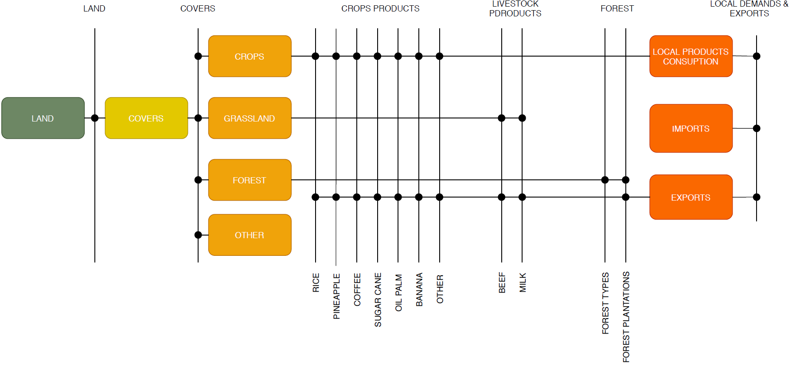

2. Land model: Framework 
=======================================

The land sector is a cross-cutting topic in the decarbonization plan. However, it is explicitly considered in the last three lines of actions: 

- Line of action 8 - The promotion of efficient agricultural food systems that generate low-carbon local export goods and consumption.
- Line of action 9 - Consolidation of an eco-competitive livestock model based on productive efficiency and reduction of greenhouse gases.
- Line of action 10 -Management of rural, urban and coastal territories that considers nature-based solutions (Conservation of forests and ecosystems).

Based upon these, the modeling framework structure is divided into six different land covers: 

- Forests: 
   - Forest plantations
   - Dry forest

2.1 General model structure 
+++++++++

   
   *Figure: Forest* 

2.2 Sets 
+++++++++

The sets are responsible for defining the structure of the model (i.e. temporal space, geographic space, elements of the system, etc.). In OSeMOSYS, the group of sets include: years, fuels, technologies, emissions and modes of operation. As it going to be further explained, the sets are characterized through parameters. These subsections present the sets that compose the current version of OSeMOSYS-CR.  

2.2.1 Year
---------

This corresponds to the period of analysis. For OSeMOSYS-CR it is from 2015 to 2050. However, the data from 2015 to 2018 is set acccording to historical information. 

2.2.2 Fuels
---------

2.2.3 Technologies
---------

2.2.4 Emissions
---------
+---------------------+--------------------------------------------------+
| Emission            | Description                                      |
+=====================+==================================================+
|CR02_LULUCF_ABS      | L_Forest removals                                |
+---------------------+--------------------------------------------------+
|CR02_LULUCF_EMI      | L_Land use change emissions                      |
+---------------------+--------------------------------------------------+
|CRCO2_EQ_ESTIERCOL   | L_Eq carbon dioxide manure management            |
+---------------------+--------------------------------------------------+
|CRCO2_EQ_FERMEN      | L_Eq carbon dioxide from enteric fermentation    |
+---------------------+--------------------------------------------------+
|CRCO2_ABS_P_FOR      | L_Removals from forest plantations               |
+---------------------+--------------------------------------------------+
|CRCO2_CULTIVOS       | L_Emissions from crops                           |
+---------------------+--------------------------------------------------+
|SE_DRY_Forest        | L_Ecosystem services from dry forest             |
+---------------------+--------------------------------------------------+
|SE_MANGRO_Forest     | L_Ecosystem servoces from Mangroves              |
+---------------------+--------------------------------------------------+
|SE_PALM_Fosrest      | L_Ecosystem services from Palm Forest            |
+---------------------+--------------------------------------------------+
|SE_WET_MOIST_Forest  | L_Ecosystem services from Moist Forest           |
+---------------------+--------------------------------------------------+

2.2.5 Mode of operation
---------
    
The model has one mode of operation, Mode 1, for representing the normal operation of the system.

2.2.6 Region
---------
    
The model has a nationwide scope, therefore it only has one region: Costa Rica (CR). 
  
