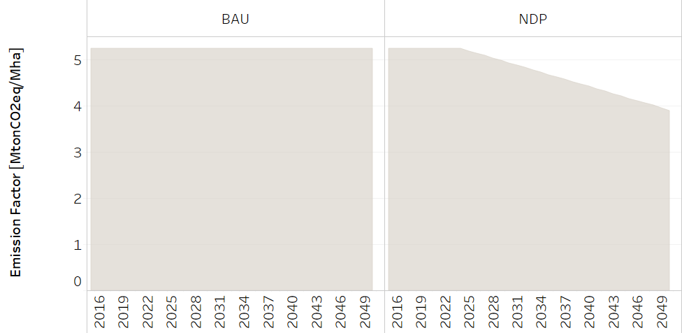
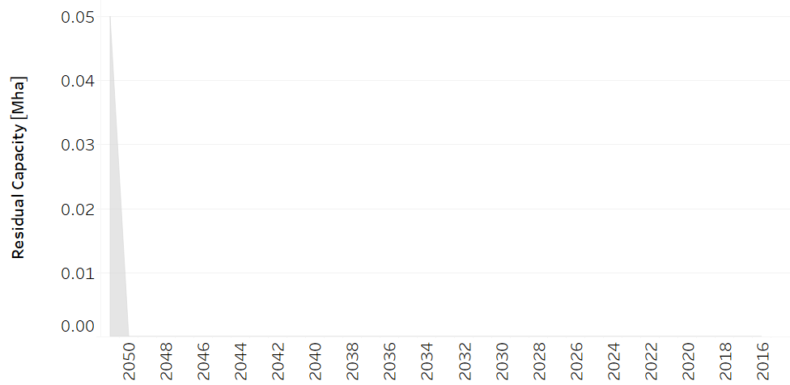

Crops
==================================

Rice crops
++++++++++

+-------------------------------------------------+-------+--------------+--------------+--------------+--------------+
| .. figure:: img/img_crops_rice.png                                                                                  |
|    :align:   center                                                                                                 |
|    :width:   500 px                                                                                                 |
+-------------------------------------------------+-------+--------------+--------------+--------------+--------------+
| Set codification:                                       |CRPRODARROZ                                                |
+-------------------------------------------------+-------+--------------+--------------+--------------+--------------+
| Description:                                            | Rice crops                                                |
+-------------------------------------------------+-------+--------------+--------------+--------------+--------------+
| Set:                                                    |Technology                                                 |
+-------------------------------------------------+-------+--------------+--------------+--------------+--------------+

CapitalCost[r,t,y]
---------

.. figure::  parameters/Rice_CapitalCost.png
   :align:   center
   :width:   550 px
   
   *Figure: Capital Cost of Rice Production* :download:`. <csv/Rice_CapitalCost.csv>`

EmissionActivityRatio[r,t,e,m,y]
---------

   
   *Figure: Capital Cost of Rice Production* :download:`. <csv/Rice_EmissionAR.csv>`

FixedCost[r,t,y]
---------

.. figure::  parameters/Rice_FixedCost.png
   :align:   center
   :width:   550 px
   
   *Figure: Capital Cost of Rice Production* :download:`. <csv/Rice_FixedCost.csv>`

OutputActivityRatio[r,t,y]
---------

.. figure::  parameters/Rice_OAR.png
   :align:   center
   :width:   550 px
   
   *Figure: Capital Cost of Rice Production* :download:`. <csv/Rice_OAR.csv>`

ResidualCapacity[r,t,y]
---------

   
   *Figure: Capital Cost of Rice Production* :download:`. <csv/Rice_ResidalCapacity.csv>`

Banana crops
++++++++++

+-------------------------------------------------+-------+--------------+--------------+--------------+--------------+
| .. figure:: img/img_crops_banana.png                                                                                |
|    :align:   center                                                                                                 |
|    :width:   500 px                                                                                                 |
+-------------------------------------------------+-------+--------------+--------------+--------------+--------------+
| Set codification:                                       |                                                           |
+-------------------------------------------------+-------+--------------+--------------+--------------+--------------+
| Description:                                            | Banana crops                                              |
+-------------------------------------------------+-------+--------------+--------------+--------------+--------------+
| Set:                                                    |Technology                                                 |
+-------------------------------------------------+-------+--------------+--------------+--------------+--------------+

EmissionActivityRatio[r,t,e,m,y]
---------

.. figure::  parameters/Banana_EmissionAR.png
   :align:   center
   :width:   550 px
   
   *Figure: Capital Cost of Rice Production* :download:`. <csv/Rice_EmissionAR.csv>`

FixedCost[r,t,y]
---------

.. figure::  parameters/Banana_FixedCost.png
   :align:   center
   :width:   550 px
   
   *Figure: Capital Cost of Rice Production* :download:`. <csv/Rice_FixedCost.csv>`

OutputActivityRatio[r,t,y]
---------

.. figure::  parameters/Banana_OAR.png
   :align:   center
   :width:   550 px
   
   *Figure: Capital Cost of Rice Production* :download:`. <csv/Rice_OAR.csv>`

ResidualCapacity[r,t,y]
---------

.. figure::  parameters/Banana_ResidualCapacity.png
   :align:   center
   :width:   550 px
   
   *Figure: Capital Cost of Rice Production* :download:`. <csv/Rice_ResidalCapacity.csv>`

Coffee crops
++++++++++

+-------------------------------------------------+-------+--------------+--------------+--------------+--------------+
| .. figure:: img/img_crops_coffee.png                                                                                |
|    :align:   center                                                                                                 |
|    :width:   500 px                                                                                                 |
+-------------------------------------------------+-------+--------------+--------------+--------------+--------------+
| Set codification:                                       |                                                           |
+-------------------------------------------------+-------+--------------+--------------+--------------+--------------+
| Description:                                            |Coffee crops                                               |
+-------------------------------------------------+-------+--------------+--------------+--------------+--------------+
| Set:                                                    |Technology                                                 |
+-------------------------------------------------+-------+--------------+--------------+--------------+--------------+

CapitalCost[r,t,y]
---------

.. figure::  parameters/Coffee_CapitalCost.png
   :align:   center
   :width:   550 px
   
   *Figure: Capital Cost of Rice Production* :download:`. <csv/Rice_CapitalCost.csv>`

EmissionActivityRatio[r,t,e,m,y]
---------

   
   *Figure: Capital Cost of Rice Production* :download:`. <csv/Rice_EmissionAR.csv>`

FixedCost[r,t,y]
---------

.. figure::  parameters/Coffee_FixedCost.png
   :align:   center
   :width:   550 px
   
   *Figure: Capital Cost of Rice Production* :download:`. <csv/Rice_FixedCost.csv>`

OutputActivityRatio[r,t,y]
---------

.. figure::  parameters/Coffee_OAR.png
   :align:   center
   :width:   550 px
   
   *Figure: Capital Cost of Rice Production* :download:`. <csv/Rice_OAR.csv>`

ResidualCapacity[r,t,y]
---------

.. figure::  parameters/Coffee_ResidualCapacity.png
   :align:   center
   :width:   550 px
   
   *Figure: Capital Cost of Rice Production* :download:`. <csv/Rice_ResidalCapacity.csv>`

Sugar Cane crops
++++++++++

+-------------------------------------------------+-------+--------------+--------------+--------------+--------------+
| .. figure:: img/img_crops_sugar_cane.png                                                                            |
|    :align:   center                                                                                                 |
|    :width:   500 px                                                                                                 |
+-------------------------------------------------+-------+--------------+--------------+--------------+--------------+
| Set codification:                                       |                                                           |
+-------------------------------------------------+-------+--------------+--------------+--------------+--------------+
| Description:                                            | Sugar Cane crops                                          |
+-------------------------------------------------+-------+--------------+--------------+--------------+--------------+
| Set:                                                    |Technology                                                 |
+-------------------------------------------------+-------+--------------+--------------+--------------+--------------+

CapitalCost[r,t,y]
---------

   
   *Figure: Capital Cost of Rice Production* :download:`. <csv/Rice_CapitalCost.csv>`

EmissionActivityRatio[r,t,e,m,y]
---------

.. figure::  parameters/Sugar_Cane_EmissionAR.png
   :align:   center
   :width:   550 px
   
   *Figure: Capital Cost of Rice Production* :download:`. <csv/Rice_EmissionAR.csv>`

FixedCost[r,t,y]
---------

.. figure::  parameters/Sugar_Cane_FixedCost.png
   :align:   center
   :width:   550 px
   
   *Figure: Capital Cost of Rice Production* :download:`. <csv/Rice_FixedCost.csv>`

OutputActivityRatio[r,t,y]
---------

.. figure::  parameters/Sugar_Cane_OAR.png
   :align:   center
   :width:   550 px
   
   *Figure: Capital Cost of Rice Production* :download:`. <csv/Rice_OAR.csv>`

ResidualCapacity[r,t,y]
---------

.. figure::  parameters/Sugar_Cane_ResidualCapacity.png
   :align:   center
   :width:   550 px
   
   *Figure: Capital Cost of Rice Production* :download:`. <csv/Rice_ResidalCapacity.csv>`

Palm Oil crops
++++++++++

+-------------------------------------------------+-------+--------------+--------------+--------------+--------------+
| .. figure:: img/img_crops_palm_oil.png                                                                              |
|    :align:   center                                                                                                 |
|    :width:   500 px                                                                                                 |
+-------------------------------------------------+-------+--------------+--------------+--------------+--------------+
| Set codification:                                       |                                                           |
+-------------------------------------------------+-------+--------------+--------------+--------------+--------------+
| Description:                                            | Palm Oil crops                                            |
+-------------------------------------------------+-------+--------------+--------------+--------------+--------------+
| Set:                                                    |Technology                                                 |
+-------------------------------------------------+-------+--------------+--------------+--------------+--------------+

CapitalCost[r,t,y]
---------

.. figure::  parameters/Palm_CapitalCost.png
   :align:   center
   :width:   550 px
   
   *Figure: Capital Cost of Rice Production* :download:`. <csv/Rice_CapitalCost.csv>`

EEmissionActivityRatio[r,t,e,m,y]
---------

   
   *Figure: Capital Cost of Rice Production* :download:`. <csv/Rice_EmissionAR.csv>`

FixedCost[r,t,y]
---------

.. figure::  parameters/Palm_FixedCost.png
   :align:   center
   :width:   550 px
   
   *Figure: Capital Cost of Rice Production* :download:`. <csv/Rice_FixedCost.csv>`

OutputActivityRatio[r,t,y]
---------

.. figure::  parameters/Palm_OAR.png
   :align:   center
   :width:   550 px
   
   *Figure: Capital Cost of Rice Production* :download:`. <csv/Rice_OAR.csv>`

ResidualCapacity[r,t,y]
---------

.. figure::  parameters/Palm_ResidualCapacity.png
   :align:   center
   :width:   550 px
   
   *Figure: Capital Cost of Rice Production* :download:`. <csv/Rice_ResidalCapacity.csv>`

Pineapple crops
++++++++++

+-------------------------------------------------+-------+--------------+--------------+--------------+--------------+
| .. figure:: img/img_crops_pine_apple.png                                                                            |
|    :align:   center                                                                                                 |
|    :width:   500 px                                                                                                 |
+-------------------------------------------------+-------+--------------+--------------+--------------+--------------+
| Set codification:                                       |                                                           |
+-------------------------------------------------+-------+--------------+--------------+--------------+--------------+
| Description:                                            |Pineapple crops                                            |
+-------------------------------------------------+-------+--------------+--------------+--------------+--------------+
| Set:                                                    |Technology                                                 |
+-------------------------------------------------+-------+--------------+--------------+--------------+--------------+

CapitalCost[r,t,y]
---------

.. figure::  parameters/Pineapple_CapitalCost.png
   :align:   center
   :width:   550 px
   
   *Figure: Capital Cost of Rice Production* :download:`. <csv/Rice_CapitalCost.csv>`

EmissionActivityRatio[r,t,e,m,y]
---------

.. figure::  parameters/Pineapple_EmissionAR.png
   :align:   center
   :width:   550 px
   
   *Figure: Capital Cost of Rice Production* :download:`. <csv/Rice_EmissionAR.csv>`

FixedCost[r,t,y]
---------

.. figure::  parameters/Pineapple_FixedCost.png
   :align:   center
   :width:   550 px
   
   *Figure: Capital Cost of Rice Production* :download:`. <csv/Rice_FixedCost.csv>`

OutputActivityRatio[r,t,y]
---------

   
   *Figure: Capital Cost of Rice Production* :download:`. <csv/Rice_OAR.csv>`

ResidualCapacity[r,t,y]
---------

.. figure::  parameters/Pineapple_ResidualCapacity.png
   :align:   center
   :width:   550 px
   
   *Figure: Capital Cost of Rice Production* :download:`. <csv/Rice_ResidalCapacity.csv>`
