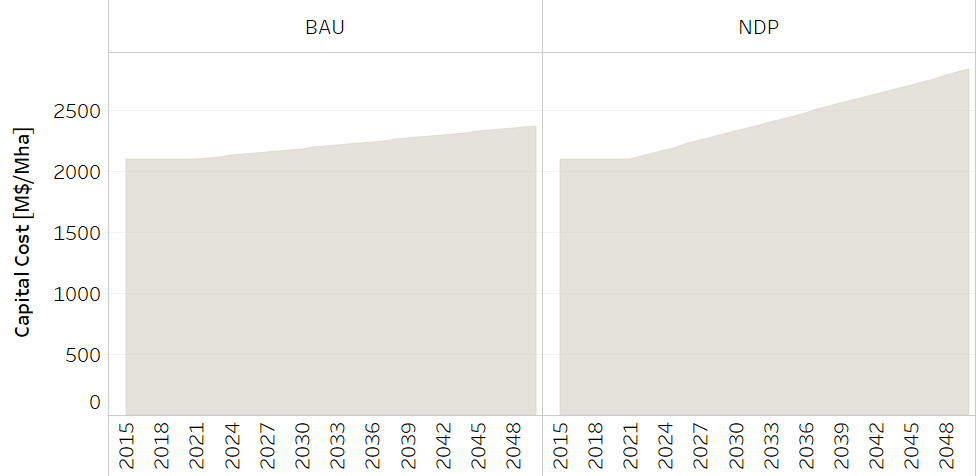
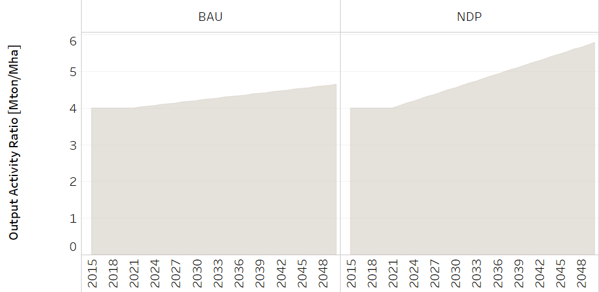

Land: Crops
==================================

The specific crops considered in the model were selected based on the area they occupy and their overall economic relevance to the country. Therefore, based on these criteria, pineapple, coffee, banana, sugarcane, oil palm, and rice were considered. A category of "others" was also included which groups crops that do not have a large area of cultivation, but are important for the country's food security (e.g., beans, corn).

Rice crops
++++++++++

.. table::
   :align:   center  

   +-------------------------------------------------+-------+--------------+--------------+--------------+--------------+
   | .. figure:: img/img_crops_rice.png                                                                                  |
   |    :align:   center                                                                                                 |
   |    :width:   500 px                                                                                                 |
   +-------------------------------------------------+-------+--------------+--------------+--------------+--------------+
   | Set codification:                                       |CRPRODARROZ                                                |
   +-------------------------------------------------+-------+--------------+--------------+--------------+--------------+
   | Description:                                            | Rice crops                                                |
   +-------------------------------------------------+-------+--------------+--------------+--------------+--------------+
   | Set:                                                    |Technology                                                 |
   +-------------------------------------------------+-------+--------------+--------------+--------------+--------------+

CapitalCost[r,t,y]
---------

The capital cost is given in MUS$ per Mha. This information is based on reports of the National Rice Corporation (CONARROZ). It includes aspects such as soil preparation, seeds, cleaning, and drainage preparation, among others.

   
   *Figure: Capital Cost of Rice Production* :download:`. <csv/Rice_CapitalCost.csv>`

EmissionActivityRatio[r,t,e,m,y]
---------

The data on emissions is based on the National Inventory of Greenhouse Gases. To calculate the emission factor per hectare, the total emissions (CH4) of rice crops were divided by the total number of occupied hectares this type of crop, and then converted into tons of CO2 equivalent. 

In the BAU scenario, emission factors remain constant until 2050, considering that there are not changes in the way rice is produced. In the NDP scenario, emissions factors decrease by 39% from 2022 onwards. This modification is based on the Food and Agriculture Organization's GHG emission projections for agriculture, and it contemplates more sustainable rice production schemes.

.. figure::  parameters/Rice_EmissionAR.png
   :align:   center
   :width:   550 px
   
   *Figure: Emission Activity Ratio of Rice Production* :download:`. <csv/Rice_EmissionAR.csv>`

FixedCost[r,t,y]
---------

This data is based on information from the Central Bank of Costa Rica. 

   
   *Figure: Fixed Cost of Rice Production* :download:`. <csv/Rice_FixedCost.csv>`

OutputActivityRatio[r,t,y]
---------

This parameter represents the crop yield. This parameter is based on historical data from reports of the Executive Secretariat for Agricultural Sector Planning. In the BAU scenario, the crop yield increase according to the historical data. In the NDP scenario, the increase is greater since better production practices are put into place.  

   
   *Figure: Output Activity Ratio of Rice Production* :download:`. <csv/Rice_OAR.csv>`

ResidualCapacity[r,t,y]
---------

Here, the residual capacity is understood as the area remaining from a period prior to modeling and is obtained by subtracting each year a proportion of the available area (Mha) based on an average of the operational life of rice crops. It is a function and tends to zero. This parameter is based on the following equation: 

.. math::

   \frac{Area(year-1) -  Area(year)}{Operational\ life}. 
   
In the case of rice crops, their operational life is 1 year. The data is based on the National Territorial Information System, from the Executive Secretariat of Agricultural Sector Planning (SEPSA) and from the Ministry of Agriculture and Livestock (MAG). 

.. figure::  parameters/Rice_ResidualCapacity.png
   :align:   center
   :width:   550 px
   
   *Figure: Residual Capacity of Rice Production* :download:`. <csv/Rice_ResidualCapacity.csv>`

Banana crops
++++++++++

.. table::
   :align:   center  
   
   +-------------------------------------------------+-------+--------------+--------------+--------------+--------------+
   |.. figure:: img/img_crops_banana.png                                                                                 |
   |    :align:   center                                                                                                 |
   |    :width:   500 px                                                                                                 |
   +-------------------------------------------------+-------+--------------+--------------+--------------+--------------+
   | Set codification:                                       |                                                           |
   +-------------------------------------------------+-------+--------------+--------------+--------------+--------------+
   | Description:                                            | Banana crops                                              |
   +-------------------------------------------------+-------+--------------+--------------+--------------+--------------+
   | Set:                                                    |Technology                                                 |
   +-------------------------------------------------+-------+--------------+--------------+--------------+--------------+

CapitalCost[r,t,y]
---------

The capital cost is given in MUS$ per Mha. This information is based on reports of the Executive Secretariat of Agricultural Sector Planning (SEPSA). It includes aspects such as soil preparation, seeds, cleaning, and drainage preparation, among others.

.. figure::  parameters/Banana_CapitalCost.png
   :align:   center
   :width:   550 px
   
   *Figure: Capital Cost of Banana Production* :download:`. <csv/Banana_CapitalCost.csv>`

EmissionActivityRatio[r,t,e,m,y]
---------

The data on emissions is based on the National Inventory of Greenhouse Gases. To calculate the emission factor per hectare, the total emissions (CH4) of banana crops were divided by the total number of occupied hectares this type of crop, and then converted into tons of CO2 equivalent. 

In the BAU scenario, emission factors remain constant until 2050, considering that there are not changes in the way bananas are produced. In the NDP scenario, emissions factors decrease by 39% from 2022 onwards. This modification is based on the Food and Agriculture Organization's GHG emission projections for agriculture, and it contemplates more sustainable rice production schemes.

.. figure::  parameters/Banana_EmissionAR.png
   :align:   center
   :width:   550 px
   
   *Figure: Emission Activity Ratio of Banana Production* :download:`. <csv/Banana_EmissionAR.csv>`

FixedCost[r,t,y]
---------

This data is based on information from the Central Bank of Costa Rica. 

   
   *Figure: Fixed Cost of Banana Production* :download:`. <csv/Banana_FixedCost.csv>`

OutputActivityRatio[r,t,y]
---------

This parameter represents the crop yield. This parameter is based on historical data from reports of the Executive Secretariat for Agricultural Sector Planning. In the BAU scenario, the crop yield increase according to the historical data. In the NDP scenario, the increase is greater since better production practices are put into place. 

   
   *Figure: Output Activity Ratio of Banana Production* :download:`. <csv/Banana_OAR.csv>`

ResidualCapacity[r,t,y]
---------

Here, the residual capacity is understood as the area remaining from a period prior to modeling and is obtained by subtracting each year a proportion of the available area (Mha) based on an average of the operational life of rice crops. It is a function and tends to zero. This parameter is based on the following equation: 

.. math::

   \frac{Area(year-1) -  Area(year)}{Operational\ life}. 
   
In the case of banana crops, their operational life is 15 years. The data is based on the National Territorial Information System, from the Executive Secretariat of Agricultural Sector Planning (SEPSA) and from the Ministry of Agriculture and Livestock (MAG). 

.. figure::  parameters/Banana_ResidualCapacity.png
   :align:   center
   :width:   550 px
   
   *Figure: Residual Capacity of Banana Production* :download:`. <csv/Banana_ResidualCapacity.csv>`

Coffee crops
++++++++++
.. table::
   :align:   center  
   
   +-------------------------------------------------+-------+--------------+--------------+--------------+--------------+
   | .. figure:: img/img_crops_coffee.png                                                                                |
   |    :align:   center                                                                                                 |
   |    :width:   500 px                                                                                                 |
   +-------------------------------------------------+-------+--------------+--------------+--------------+--------------+
   | Set codification:                                       |CRPRODCAF                                                  |
   +-------------------------------------------------+-------+--------------+--------------+--------------+--------------+
   | Description:                                            |Coffee crops                                               |
   +-------------------------------------------------+-------+--------------+--------------+--------------+--------------+
   | Set:                                                    |Technology                                                 |
   +-------------------------------------------------+-------+--------------+--------------+--------------+--------------+

CapitalCost[r,t,y]
---------

The capital cost is given in MUS$ per Mha. This information is based on reports of the Costa Rican Coffee Institude (ICAFE). It includes aspects such as soil preparation, seeds, cleaning, and drainage preparation, among others.

   
   *Figure: Capital Cost of Coffee Production* :download:`. <csv/Coffee_CapitalCost.csv>`

EmissionActivityRatio[r,t,e,m,y]
---------

The data on emissions is based on the National Inventory of Greenhouse Gases. To calculate the emission factor per hectare, the total emissions (CH4) of coffee crops were divided by the total number of occupied hectares this type of crop, and then converted into tons of CO2 equivalent. 

In the BAU scenario, emission factors remain constant until 2050, considering that there are not changes in the way coffee is produced. In the NDP scenario, emissions factors decrease by 39% from 2022 onwards. This modification is based on the Food and Agriculture Organization's GHG emission projections for agriculture, and it contemplates more sustainable rice production schemes.

.. figure::  parameters/Coffee_EmissionAR.png
   :align:   center
   :width:   550 px
   
   *Figure: Emission Activity Ratio of Coffee Production* :download:`. <csv/Coffee_EmissionAR.csv>`

FixedCost[r,t,y]
---------

This data is based on information from the Central Bank of Costa Rica. 

.. figure::  parameters/Coffee_FixedCost.png
   :align:   center
   :width:   550 px
   
   *Figure: Fixed Cost of Coffee Production* :download:`. <csv/Coffee_FixedCost.csv>`

OutputActivityRatio[r,t,y]
---------

.. figure::  parameters/Coffee_OAR.png
   :align:   center
   :width:   550 px
   
   *Figure: Output Activity Ratio of Coffee Production* :download:`. <csv/Coffee_OAR.csv>`

ResidualCapacity[r,t,y]
---------

Here, the residual capacity is understood as the area remaining from a period prior to modeling and is obtained by subtracting each year a proportion of the available area (Mha) based on an average of the operational life of coffee crops. It is a function and tends to zero. This parameter is based on the following equation: 

.. math::

   \frac{Area(year-1) -  Area(year)}{Operational\ life}. 
   
In the case of coffee crops, their operational life is 20 years. The data is based on the National Territorial Information System, from the Executive Secretariat of Agricultural Sector Planning (SEPSA) and from the Ministry of Agriculture and Livestock (MAG). 

   
   *Figure: Residual Capacity of Coffee Production* :download:`. <csv/Coffee_ResidualCapacity.csv>`

Sugar Cane crops
++++++++++
.. table::
   :align:   center  
   
   +-------------------------------------------------+-------+--------------+--------------+--------------+--------------+
   | .. figure:: img/img_crops_sugar_cane.png                                                                            |
   |    :align:   center                                                                                                 |
   |    :width:   500 px                                                                                                 |
   +-------------------------------------------------+-------+--------------+--------------+--------------+--------------+
   | Set codification:                                       |CRPRODCANA                                                 |
   +-------------------------------------------------+-------+--------------+--------------+--------------+--------------+
   | Description:                                            | Sugar Cane crops                                          |
   +-------------------------------------------------+-------+--------------+--------------+--------------+--------------+
   | Set:                                                    |Technology                                                 |
   +-------------------------------------------------+-------+--------------+--------------+--------------+--------------+

CapitalCost[r,t,y]
---------

The capital cost is given in MUS$ per Mha. This information is based on reports of the National Federation of Oil Palm Growers (FEDEPALMA). It includes aspects such as soil preparation, seeds, cleaning, and drainage preparation, among others.

.. figure::  parameters/Sugar_Cane_CapitalCost.png
   :align:   center
   :width:   550 px
   
   *Figure: Capital Cost of Sugar Cane Production* :download:`. <csv/Sugar_Cane_CapitalCost.csv>`

EmissionActivityRatio[r,t,e,m,y]
---------

The data on emissions is based on the National Inventory of Greenhouse Gases. To calculate the emission factor per hectare, the total emissions (CH4) of sugar cane crops were divided by the total number of occupied hectares this type of crop, and then converted into tons of CO2 equivalent. 

In the BAU scenario, emission factors remain constant until 2050, considering that there are not changes in the way rice is produced. In the NDP scenario, emissions factors decrease by 39% from 2022 onwards. This modification is based on the Food and Agriculture Organization's GHG emission projections for agriculture, and it contemplates more sustainable sugar cane production schemes.

.. figure::  parameters/Sugar_Cane_EmissionAR.png
   :align:   center
   :width:   550 px
   
   *Figure: Emission Activity Ratio of Sugar Cane Production* :download:`. <csv/Sugar_Cane_EmissionAR.csv>`

FixedCost[r,t,y]
---------

This data is based on information from the Central Bank of Costa Rica. 

.. figure::  parameters/Sugar_Cane_FixedCost.png
   :align:   center
   :width:   550 px
   
   *Figure: Fixed Cost of Sugar Cane Production* :download:`. <csv/Sugar_Cane_FixedCost.csv>`

OutputActivityRatio[r,t,y]
---------

This parameter represents the crop yield. This parameter is based on historical data from reports of the Executive Secretariat for Agricultural Sector Planning. In the BAU scenario, the crop yield increase according to the historical data. In the NDP scenario, the increase is greater since better production practices are put into place. 

.. figure::  parameters/Sugar_Cane_OAR.png
   :align:   center
   :width:   550 px
   
   *Figure: Output Activity Ratio of Sugar Cane Production* :download:`. <csv/Sugar_Cane_OAR.csv>`

ResidualCapacity[r,t,y]
---------

Here, the residual capacity is understood as the area remaining from a period prior to modeling and is obtained by subtracting each year a proportion of the available area (Mha) based on an average of the operational life of sugar cane crops. It is a function and tends to zero. This parameter is based on the following equation: 

.. math::

   \frac{Area(year-1) -  Area(year)}{Operational\ life}. 
   
In the case of rice crops, their operational life is 5 years. The data is based on the National Territorial Information System, from the Executive Secretariat of Agricultural Sector Planning (SEPSA) and from the Ministry of Agriculture and Livestock (MAG). 

   
   *Figure: Residual Capacity of Sugar Cane Production* :download:`. <csv/Sugar_Cane_ResidualCapacity.csv>`

Palm Oil crops
++++++++++

.. table::
   :align:   center  
   
   +-------------------------------------------------+-------+--------------+--------------+--------------+--------------+
   | .. figure:: img/img_crops_palm_oil.png                                                                              |
   |    :align:   center                                                                                                 |
   |    :width:   500 px                                                                                                 |
   +-------------------------------------------------+-------+--------------+--------------+--------------+--------------+
   | Set codification:                                       |CRPRODPALM                                                 |
   +-------------------------------------------------+-------+--------------+--------------+--------------+--------------+
   | Description:                                            |Palm Oil crops                                             |
   +-------------------------------------------------+-------+--------------+--------------+--------------+--------------+
   | Set:                                                    |Technology                                                 |
   +-------------------------------------------------+-------+--------------+--------------+--------------+--------------+

CapitalCost[r,t,y]
---------

The capital cost is given in MUS$ per Mha. This information is based on reports of the National Federation of Oil Palm Growers (FEDEPALMA). It includes aspects such as soil preparation, seeds, cleaning, and drainage preparation, among others.

.. figure::  parameters/Palm_CapitalCost.png
   :align:   center
   :width:   550 px
   
   *Figure: Capital Cost of Palm Oil Production* :download:`. <csv/Palm_CapitalCost.csv>`

EmissionActivityRatio[r,t,e,m,y]
---------

The data on emissions is based on the National Inventory of Greenhouse Gases. To calculate the emission factor per hectare, the total emissions (CH4) of palm oil crops were divided by the total number of occupied hectares this type of crop, and then converted into tons of CO2 equivalent. 

In the BAU scenario, emission factors remain constant until 2050, considering that there are not changes in the way rice is produced. In the NDP scenario, emissions factors decrease by 39% from 2022 onwards. This modification is based on the Food and Agriculture Organization's GHG emission projections for agriculture, and it contemplates more sustainable rice production schemes.

.. figure::  parameters/Palm_EmissionAR.png
   :align:   center
   :width:   550 px
   
   *Figure: Emission Activity ratio of Palm Oil Production* :download:`. <csv/Palm_EmissionAR.csv>`

FixedCost[r,t,y]
---------

This data is based on information from the Central Bank of Costa Rica. 

.. figure::  parameters/Palm_FixedCost.png
   :align:   center
   :width:   550 px
   
   *Figure: Fixed Cost of Palm Oil Production* :download:`. <csv/Palm_FixedCost.csv>`

OutputActivityRatio[r,t,y]
---------

This parameter represents the crop yield. This parameter is based on historical data from reports of the Executive Secretariat for Agricultural Sector Planning. In the BAU scenario, the crop yield increase according to the historical data. In the NDP scenario, the increase is greater since better production practices are put into place. 

.. figure::  parameters/Palm_OAR.png
   :align:   center
   :width:   550 px
   
   *Figure: Output Activity of Palm Oil Production* :download:`. <csv/Palm_OAR.csv>`

ResidualCapacity[r,t,y]
---------

Here, the residual capacity is understood as the area remaining from a period prior to modeling and is obtained by subtracting each year a proportion of the available area (Mha) based on an average of the operational life of palm oil crops. It is a function and tends to zero. This parameter is based on the following equation: 

.. math::

   \frac{Area(year-1) -  Area(year)}{Operational\ life}. 
   
In the case of palm oil crops, their operational life is 25 years. The data is based on the National Territorial Information System, from the Executive Secretariat of Agricultural Sector Planning (SEPSA) and from the Ministry of Agriculture and Livestock (MAG). 

   
   *Figure: Residual Capacity of Palm Oil Production* :download:`. <csv/Palm_ResidualCapacity.csv>`

Pineapple crops
++++++++++

.. table::
   :align:   center   
   
   +-------------------------------------------------+-------+--------------+--------------+--------------+--------------+
   | .. figure:: img/img_crops_pine_apple.png                                                                            |
   |    :align:   center                                                                                                 |
   |    :width:   500 px                                                                                                 |
   +-------------------------------------------------+-------+--------------+--------------+--------------+--------------+
   | Set codification:                                       |CRPRODPIN                                                  |
   +-------------------------------------------------+-------+--------------+--------------+--------------+--------------+
   | Description:                                            |Pineapple crops                                            |
   +-------------------------------------------------+-------+--------------+--------------+--------------+--------------+
   | Set:                                                    |Technology                                                 |
   +-------------------------------------------------+-------+--------------+--------------+--------------+--------------+

CapitalCost[r,t,y]
---------

The capital cost is given in MUS$ per Mha. This information is based on reports of the Executive Secretariat of Agricultural Sector Planning (SEPSA). It includes aspects such as soil preparation, seeds, cleaning, and drainage preparation, among others.

.. figure::  parameters/Pineapple_CapitalCost.png
   :align:   center
   :width:   550 px
   
   *Figure: Capital Cost of Pineapple Production* :download:`. <csv/Pineapple_CapitalCost.csv>`

FixedCost[r,t,y]
---------

This data is based on information from the Central Bank of Costa Rica. 

.. figure::  parameters/Pineapple_FixedCost.png
   :align:   center
   :width:   550 px
   
   *Figure: Fixed Cost of Pineapple Production* :download:`. <csv/Pineapple_FixedCost.csv>`
   
OutputActivityRatio[r,t,y]
---------

This parameter represents the crop yield. This parameter is based on historical data from reports of the Executive Secretariat for Agricultural Sector Planning. In the BAU scenario, the crop yield increase according to the historical data. In the NDP scenario, the increase is greater since better production practices are put into place. 

.. figure::  parameters/Pineapple_OAR.png
   :align:   center
   :width:   550 px
   
   *Figure: Output Activity Ratio of Pineapple Production* :download:`. <csv/Pineapple_OAR.csv>`

ResidualCapacity[r,t,y]
---------

Here, the residual capacity is understood as the area remaining from a period prior to modeling and is obtained by subtracting each year a proportion of the available area (Mha) based on an average of the operational life of pineapple crops. It is a function and tends to zero. This parameter is based on the following equation: 

.. math::

   \frac{Area(year-1) -  Area(year)}{Operational\ life}. 
   
In the case of pineapple crops, their operational life is 1 year. The data is based on the National Territorial Information System, from the Executive Secretariat of Agricultural Sector Planning (SEPSA) and from the Ministry of Agriculture and Livestock (MAG). 

.. figure::  parameters/Pineapple_ResidualCapacity.png
   :align:   center
   :width:   550 px
   
   *Figure: Residual Capacity of Pineapple Production* :download:`. <csv/Pineapple_ResidualCapacity.csv>`
