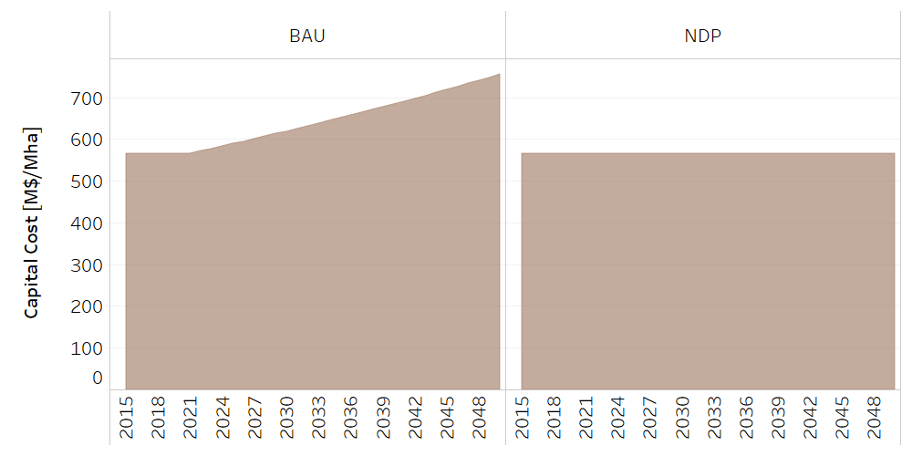
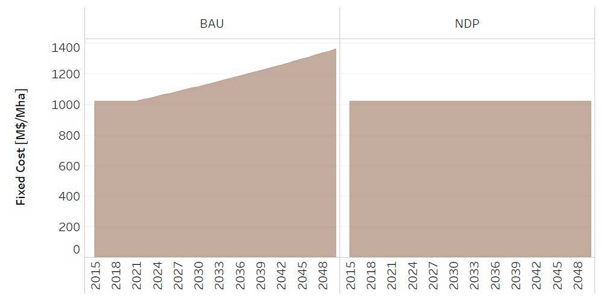
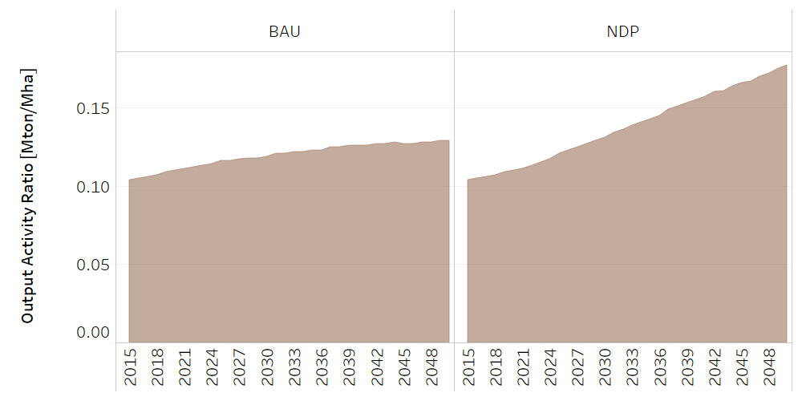
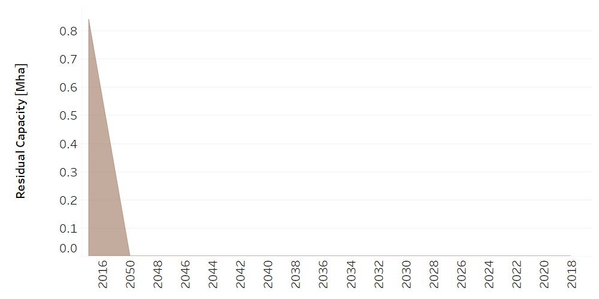
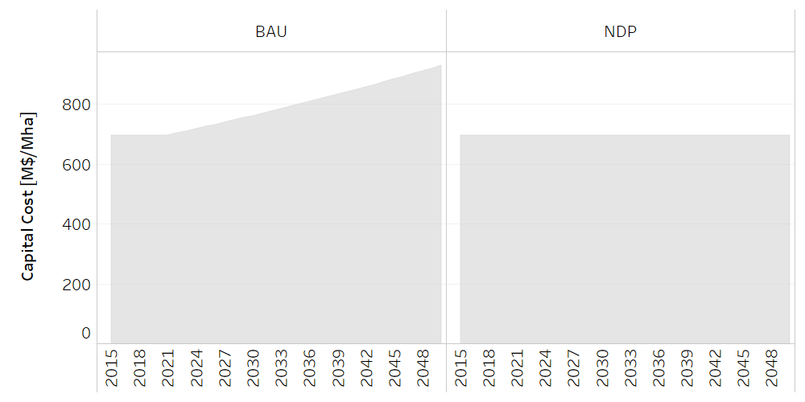
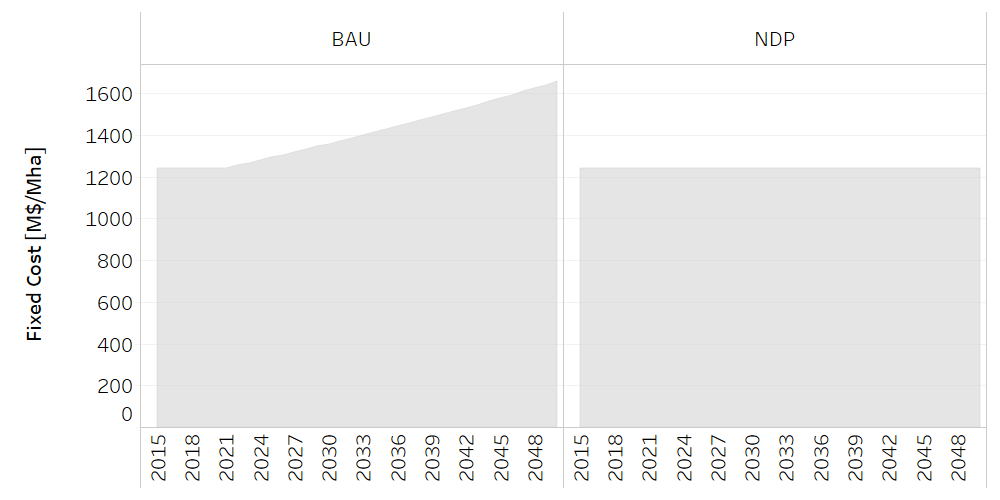
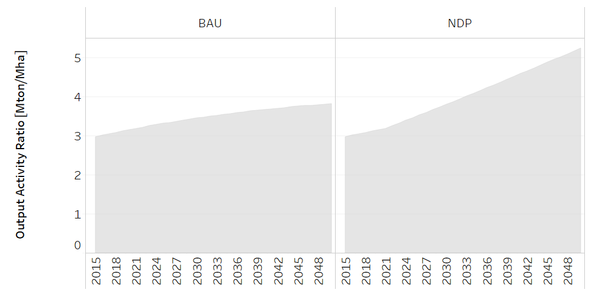
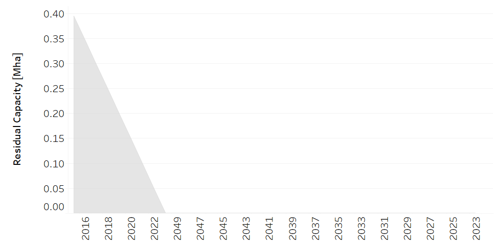

Grassland
==================================

Beef
++++++++++
.. table::
   :align:   center  
   
   +-------------------------------------------------+-------+--------------+--------------+--------------+--------------+
   | .. figure:: img/img_grassland_beef.png                                                                              |
   |    :align:   center                                                                                                 |
   |    :width:   500 px                                                                                                 |
   +-------------------------------------------------+-------+--------------+--------------+--------------+--------------+
   | Set codification:                                       |CRPRODCARN_Vacu                                            |
   +-------------------------------------------------+-------+--------------+--------------+--------------+--------------+
   | Description:                                            | Beef                                                      |
   +-------------------------------------------------+-------+--------------+--------------+--------------+--------------+
   | Set:                                                    |Technology                                                 |
   +-------------------------------------------------+-------+--------------+--------------+--------------+--------------+

CapitalCost[r,t,y]
---------

   
   *Figure: Capital Cost of Beef Production* :download:`. <csv/Beef_CapitalCost.csv>`

FixedCost[r,t,y]
---------

   
   *Figure: Fixed Cost of Beef Production* :download:`. <csv/Beef_FixedCost.csv>`

OutputActivityRatio[r,t,y]
---------

   
   *Figure: Output Activity Ratio of Beef Production* :download:`. <csv/Beef_OAR.csv>`

ResidualCapacity[r,t,y]
---------

   
   *Figure: Residual Capacity of Beef Production* :download:`. <csv/Beef_ResidualCapacity.csv>`

Milk
++++++++++

.. table::
   :align:   center  
   
   +-------------------------------------------------+-------+--------------+--------------+--------------+--------------+
   | .. figure:: img/img_grassland_milk.png                                                                              |
   |    :align:   center                                                                                                 |
   |    :width:   500 px                                                                                                 |
   +-------------------------------------------------+-------+--------------+--------------+--------------+--------------+
   | Set codification:                                       |CRPRODLECH                                                 |
   +-------------------------------------------------+-------+--------------+--------------+--------------+--------------+
   | Description:                                            | Milk                                                      |
   +-------------------------------------------------+-------+--------------+--------------+--------------+--------------+
   | Set:                                                    |Technology                                                 |
   +-------------------------------------------------+-------+--------------+--------------+--------------+--------------+

CapitalCost[r,t,y]
---------

   
   *Figure: Capital Cost of Milk Production* :download:`. <csv/Milk_CapitalCost.csv>`

FixedCost[r,t,y]
---------

   
   *Figure: Fixed Cost of Milk Production* :download:`. <csv/Milk_FixedCost.csv>`

OutputActivityRatio[r,t,y]
---------

   
   *Figure: Output Activity Ratio of Milk Production* :download:`. <csv/Milk_OAR.csv>`

ResidualCapacity[r,t,y]
---------

   
   *Figure: Residual Capacity of Milk Production* :download:`. <csv/Milk_ResidualCapacity.csv>`
