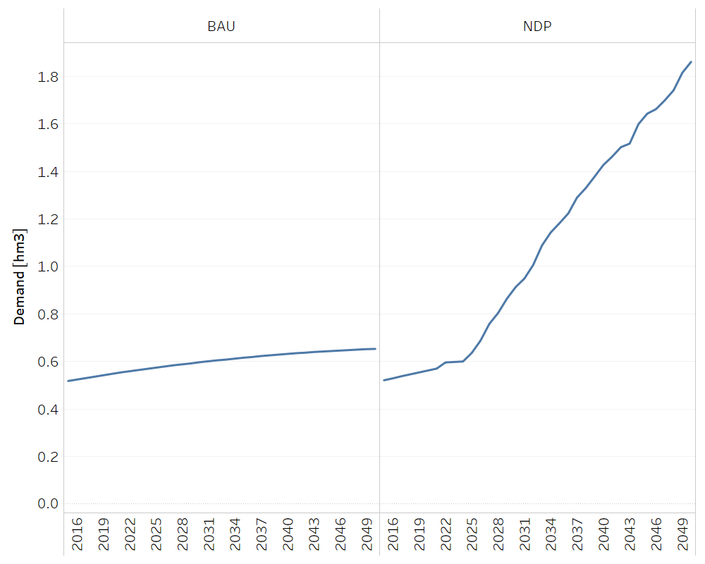

Demands
==================================

In this section, the demand are separated in three categories: crops demands, livestock demands and wood demand. 

Crops Demands
++++++++++

.. table::
   :align:   center  
   
   +-------------------------------------------------+-------+--------------+--------------+--------------+--------------+
   | .. figure:: img/img_crops_demands.png                                                                               |
   |    :align:   center                                                                                                 |
   |    :width:   500 px                                                                                                 |
   +-------------------------------------------------+-------+--------------+--------------+--------------+--------------+
   | Set codification:                                       |CR07DEMAPINA, CR07DEMAAZUCAR, CR07DEMAMELA,                |
   |                                                         |CR07DEMAARROZ, CR07DEMABAGAZO, CR07DEMAACEITE,             |
   |                                                         |CR07DEMABANANO, CR07DEMACAFORO                             |
   +-------------------------------------------------+-------+--------------+--------------+--------------+--------------+
   | Description:                                            |Crops Demands                                              |
   +-------------------------------------------------+-------+--------------+--------------+--------------+--------------+
   | Set:                                                    |Technology                                                 |
   +-------------------------------------------------+-------+--------------+--------------+--------------+--------------+

SpecifiedAnnualDemand[r,f,y]
---------

The pineapple, sugar, molasses, rice, bagasse, palm oil, banana and coffee future demands are calculated by using average per capita consumption data (kg/inhab/yr) and population projections (millions of people) from the National Institute of Statistics and Census of Costa Rica. In the model, the per capita consumption values are kept constant through out all of the modeling period. The demands are calculated as indicated by the following equation: 

.. math::

   Demand_{crop_i} [ \frac{Mton}{year} ] = \frac{{per\ capita\ consumption_i\ x\  population}}{1x10^9}. 
   
These demands are the same in both scenarios. The information regarding the local production, the exports and imports is crucial in order to calculate the per capita consumption values. The latter data was obtained from the National Rice Corporation and Costa Rica's Foreign Trade Promoter. In the case of the local production, the data is from reports of the National Rice Corporation, National Federation of Oil Palm Growers, and the Executive Secretariat for Agricultural Sector Planning. 

.. figure::  parameters/Demand_crops.png
   :align:   center
   :width:   550 px
   
   *Figure: Crops Demands* :download:`. <csv/Demand_crops.csv>`

Livestock Demands
++++++++++

.. table::
   :align:   center  
   
   +-------------------------------------------------+-------+--------------+--------------+--------------+--------------+
   | .. figure:: img/img_livestock_demands.png                                                                           |
   |    :align:   center                                                                                                 |
   |    :width:   500 px                                                                                                 |
   +-------------------------------------------------+-------+--------------+--------------+--------------+--------------+
   | Set codification:                                       |CR08DEMACAR_VACU, CR08DEMALECHE                            |
   +-------------------------------------------------+-------+--------------+--------------+--------------+--------------+
   | Description:                                            |Livestock Demands                                          |
   +-------------------------------------------------+-------+--------------+--------------+--------------+--------------+
   | Set:                                                    |Technology                                                 |
   +-------------------------------------------------+-------+--------------+--------------+--------------+--------------+

SpecifiedAnnualDemand[r,f,y]
---------

The beef and milk local future demands are calculated by using the same principle used for the crops demands. Here, the per capita consumption values are also kept constant through out all of the modeling period, and the demand is the same in both scenarios.  

.. figure::  parameters/Demand_livestock.png
   :align:   center
   :width:   550 px
   
   *Figure: Livestock Demands* :download:`. <csv/Demand_livestock.csv>`
   
Wood Demands
++++++++++

The wood demand in the BAU scenario is based on the same method used for agricultural products. The NDP scenario contemplates a higher demand of wood, since the National Decarbonization Plan aims at promoting the use of wood in construction. In the model, the increase in this demand results in a higher area of forest plantations. This aspect has implications in the CO2 removals in the country, which are higher in the NDP scenario.  

.. table::
   :align:   center  
   
   +-------------------------------------------------+-------+--------------+--------------+--------------+--------------+
   | .. figure:: img/img_wood_demands.png                                                                                |
   |    :align:   center                                                                                                 |
   |    :width:   500 px                                                                                                 |
   +-------------------------------------------------+-------+--------------+--------------+--------------+--------------+
   | Set codification:                                       |CR09DEM_MADERA                                             |
   +-------------------------------------------------+-------+--------------+--------------+--------------+--------------+
   | Description:                                            |Wood Demands                                               |
   +-------------------------------------------------+-------+--------------+--------------+--------------+--------------+
   | Set:                                                    |Technology                                                 |
   +-------------------------------------------------+-------+--------------+--------------+--------------+--------------+

SpecifiedAnnualDemand[r,f,y]
---------

   
   *Figure: Wood Demands* :download:`. <csv/Demand_wood.csv>`
