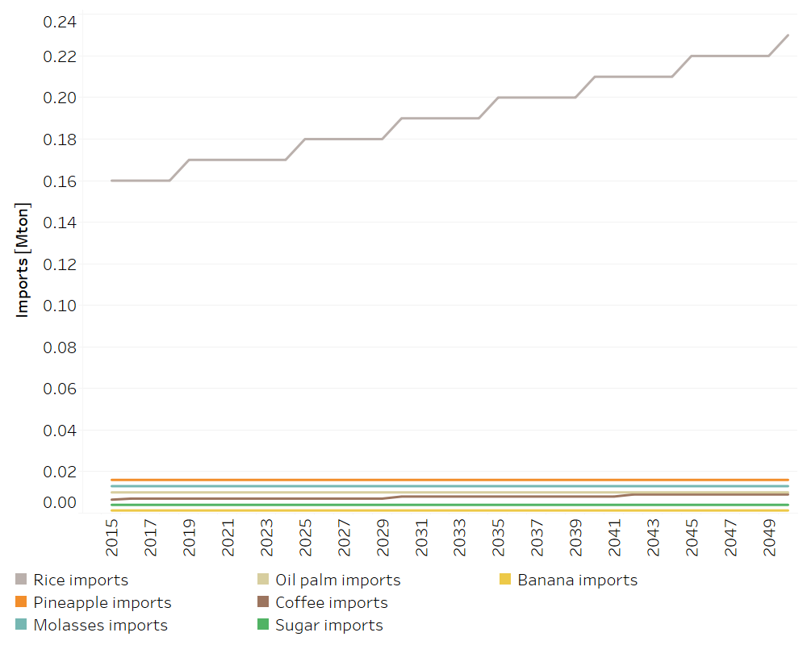

Land: Imports
==================================

Crops Imports
++++++++++

.. table::
   :align:   center  
   
   +-------------------------------------------------+-------+--------------+--------------+--------------+--------------+
   | .. figure:: img/img_crops_imports_exports.png                                                                       |
   |    :align:   center                                                                                                 |
   |    :width:   500 px                                                                                                 |
   +-------------------------------------------------+-------+--------------+--------------+--------------+--------------+
   | Set codification:                                       |CRIMPORTARROZGR, CRIMPORTPINA, CRIMPORTMELA                |
   |                                                         |CRIMPORTACEITE, CRIMPORTCAFEORO, CRIMPORTAZUCAR            |
   |                                                         |CRIMPORTBANA                                               |
   +-------------------------------------------------+-------+--------------+--------------+--------------+--------------+
   | Description:                                            |Crops Imports                                              |
   +-------------------------------------------------+-------+--------------+--------------+--------------+--------------+
   | Set:                                                    |Technology                                                 |
   +-------------------------------------------------+-------+--------------+--------------+--------------+--------------+

TotalTechnologyAnnualActivityLower and Upper Limit[r,t,y]
---------

These parameters present a lower and upper limit to the level of imports, both are expressed in Mton. The imports remain constant through out all of the modeling period, except for rice and coffee which both grow by 1% per year. The base values this parameter were calculated based on information from Costa Rica's Foreign Trade Promoter.  

   
   *Figure: Crops Imports* :download:`. <csv/Imports_crops.csv>`
   
Variable Cost [r,t,y]
---------

This parameter refers to the international prices of the agricultural products, which in this case are from a report of the World Bank Group. 

   
   *Figure: Variable Cost of Imports* :download:`. <csv/Imports_Variable_Cost.csv>`

Livestock Imports
++++++++++

.. table::
   :align:   center  
   
   +-------------------------------------------------+-------+--------------+--------------+--------------+--------------+
   | .. figure:: img/img_livestock_imports_exports.png                                                                   |
   |    :align:   center                                                                                                 |
   |    :width:   500 px                                                                                                 |
   +-------------------------------------------------+-------+--------------+--------------+--------------+--------------+
   | Set codification:                                       |CRIMPORTLECHE, CRIMPORTCAR_VACU                            |
   +-------------------------------------------------+-------+--------------+--------------+--------------+--------------+
   | Description:                                            | Livestock Imports                                         |
   +-------------------------------------------------+-------+--------------+--------------+--------------+--------------+
   | Set:                                                    |Technology                                                 |
   +-------------------------------------------------+-------+--------------+--------------+--------------+--------------+

TotalTechnologyAnnualActivityLower and Upper Limit[r,t,y]
---------

The imports of livestock products remain constant through out all of the modeling period. The base values this parameter were calculated based on information from Costa Rica's Foreign Trade Promoter. 

.. figure::  parameters/Imports_livestock.png
   :align:   center
   :width:   550 px
   
   *Figure: Livestock Imports* :download:`. <csv/Imports_livestock.csv>`
   
Variable Cost [r,t,y]
---------

This information refers to the international prices of the agricultural products, which are from a report of the World Bank Group in the case of beef and the National Chamber of Milk Producers in the case of milk. 

.. figure::  parameters/Imports_Variable_Cost_Livestock.png
   :align:   center
   :width:   550 px
   
   *Figure: Variable Cost of Imports* :download:`. <csv/Imports_Livestock_Variable_Cost.csv>`  
