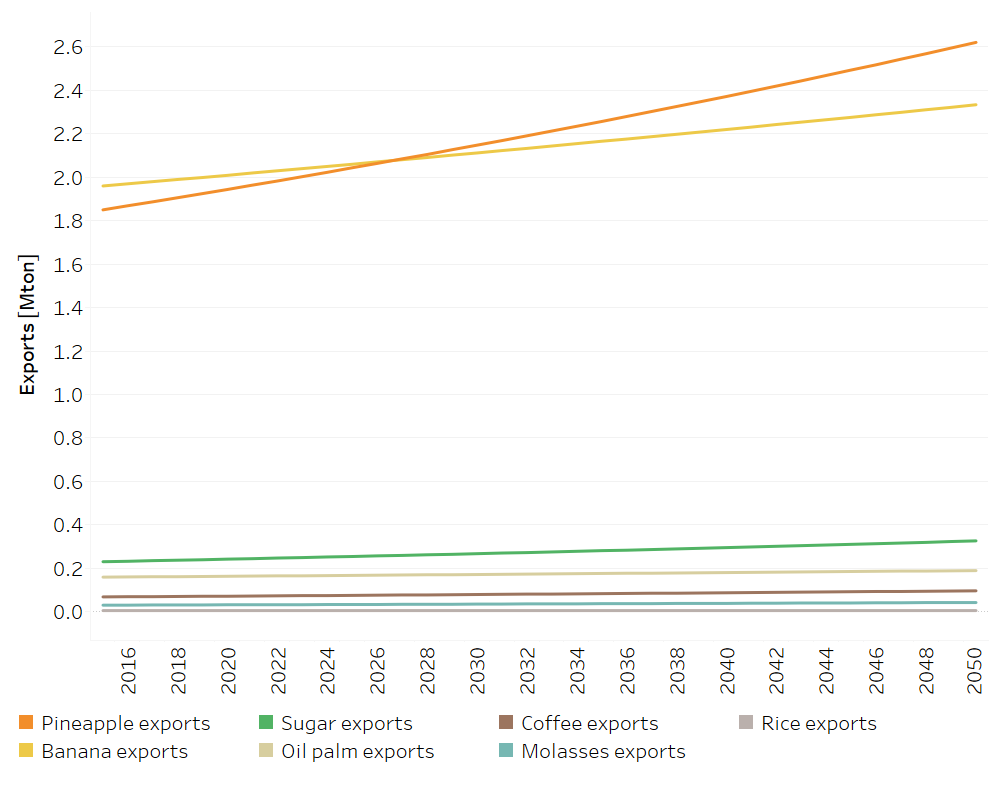

Land: Exports
==================================

Crops Exports
++++++++++

.. table::
   :align:   center  
   
   +-------------------------------------------------+-------+--------------+--------------+--------------+--------------+
   | .. figure:: img/img_crops_imports_exports.png                                                                       |
   |    :align:   center                                                                                                 |
   |    :width:   500 px                                                                                                 |
   +-------------------------------------------------+-------+--------------+--------------+--------------+--------------+
   | Set codification:                                       |CREXPORTARROZGR, CREXPORTPINA, CREXPORTMELA                |
   |                                                         |CREXPORTACEITE, CREXPORTCAFEORO, CREXPORTAZUCAR            |
   |                                                         |CREXPORTBANA                                               |
   +-------------------------------------------------+-------+--------------+--------------+--------------+--------------+
   | Description:                                            |Crops Exports                                              |
   +-------------------------------------------------+-------+--------------+--------------+--------------+--------------+
   | Set:                                                    |Technology                                                 |
   +-------------------------------------------------+-------+--------------+--------------+--------------+--------------+

SpecifiedAnnualDemand[r,f,y]
---------

This parameter stablishes the level of exported agricultural products, and it is presented in Mton. The following equation expresses the amount of exported tons for the i agricultural product:

.. math::

   Exports_i\ [Mton] = Local\ production_i\ [Mton]\ -\ Local\ demand_i\ [Mton]\ +\ imports_i\ [Mton]

   
   *Figure: Crops Exports* :download:`. <csv/Exports_crops.csv>`

   
Variable Cost [r,t,y]
---------

This parameter presents the economic gains of exporting products, which are based on information from Costa Rica's Foreign Trade Promoter.

   
   *Figure: Variable Cost of Exports* :download:`. <csv/Exports_Variable_Cost.csv>`
   
Livestock Exports
++++++++++

This parameter stablishes the level of exported agricultural products, and it is presented in Mton. It follows the same principle as the crops exports.  

.. table::
   :align:   center  
   
   +-------------------------------------------------+-------+--------------+--------------+--------------+--------------+
   | .. figure:: img/img_livestock_imports_exports.png                                                                   |
   |    :align:   center                                                                                                 |
   |    :width:   500 px                                                                                                 |
   +-------------------------------------------------+-------+--------------+--------------+--------------+--------------+
   | Set codification:                                       |CREXPORTLECHE, CR EXPORTCAR_VACU                           |
   +-------------------------------------------------+-------+--------------+--------------+--------------+--------------+
   | Description:                                            | Livestock Exports                                         |
   +-------------------------------------------------+-------+--------------+--------------+--------------+--------------+
   | Set:                                                    |Technology                                                 |
   +-------------------------------------------------+-------+--------------+--------------+--------------+--------------+
 
SpecifiedAnnualDemand[r,f,y]
---------

   
   *Figure: Crops Exports* :download:`. <csv/Exports_livestock.csv>`

   
Variable Cost [r,t,y]
---------

This parameter presents the economic gains of exporting products, which are based on information from Costa Rica's Foreign Trade Promoter and the National Chamber of Milk Producers. 

.. figure::  parameters/Exports_Variable_Cost_Livestock.png
   :align:   center
   :width:   550 px
   
   *Figure: Variable Cost of Exports* :download:`. <csv/Exports_Livestock_Variable_Cost .csv>`
