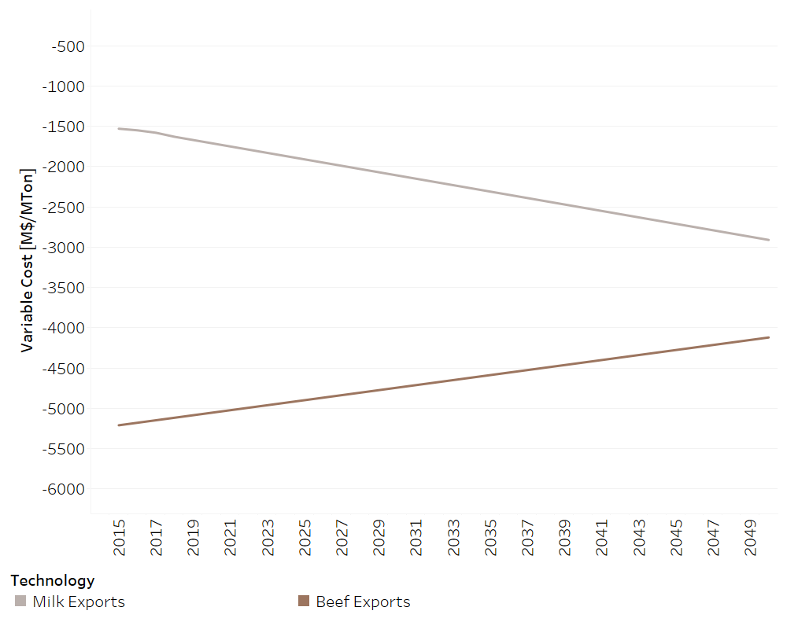

Exports
==================================

Crops Exports
++++++++++

.. table::
   :align:   center  
   
   +-------------------------------------------------+-------+--------------+--------------+--------------+--------------+
   | .. figure:: img/img_crops_imports_exports.png                                                                       |
   |    :align:   center                                                                                                 |
   |    :width:   500 px                                                                                                 |
   +-------------------------------------------------+-------+--------------+--------------+--------------+--------------+
   | Set codification:                                       |CREXPORTARROZGR, CREXPORTPINA, CREXPORTMELA                |
   |                                                         |CREXPORTACEITE, CREXPORTCAFEORO, CREXPORTAZUCAR            |
   |                                                         |CREXPORTBANA                                               |
   +-------------------------------------------------+-------+--------------+--------------+--------------+--------------+
   | Description:                                            |Crops Exports                                              |
   +-------------------------------------------------+-------+--------------+--------------+--------------+--------------+
   | Set:                                                    |Technology                                                 |
   +-------------------------------------------------+-------+--------------+--------------+--------------+--------------+

SpecifiedAnnualDemand[r,f,y]
---------

.. figure::  parameters/Exports_crops.png
   :align:   center
   :width:   550 px
   
   *Figure: Crops Exports* :download:`. <csv/Exports_crops.csv>`

   
   Variable Cost [r,t,y]
---------

.. figure::  parameters/Exports_Variable_Cost.png
   :align:   center
   :width:   550 px
   
   *Figure: Variable Cost of Exports* :download:`. <csv/Exports_Variable_Cost.csv>`

Livestock Exports
++++++++++

.. table::
   :align:   center  
   
   +-------------------------------------------------+-------+--------------+--------------+--------------+--------------+
   | .. figure:: img/img_livestock_imports_exports.png                                                                   |
   |    :align:   center                                                                                                 |
   |    :width:   500 px                                                                                                 |
   +-------------------------------------------------+-------+--------------+--------------+--------------+--------------+
   | Set codification:                                       |CREXPORTLECHE, CR EXPORTCAR_VACU                           |
   +-------------------------------------------------+-------+--------------+--------------+--------------+--------------+
   | Description:                                            | Livestock Exports                                         |
   +-------------------------------------------------+-------+--------------+--------------+--------------+--------------+
   | Set:                                                    |Technology                                                 |
   +-------------------------------------------------+-------+--------------+--------------+--------------+--------------+

SpecifiedAnnualDemand[r,f,y]
---------

.. figure::  parameters/Exports_Livestock.png
   :align:   center
   :width:   550 px
   
   *Figure: Livestock Exports* :download:`. <csv/Exports_Livestock.csv>`

   
 Variable Cost [r,t,y]
---------

   
   *Figure: Variable Cost of Livestock Exports* :download:`. <csv/Exports_Variable_Cost_Livestock.csv>`
