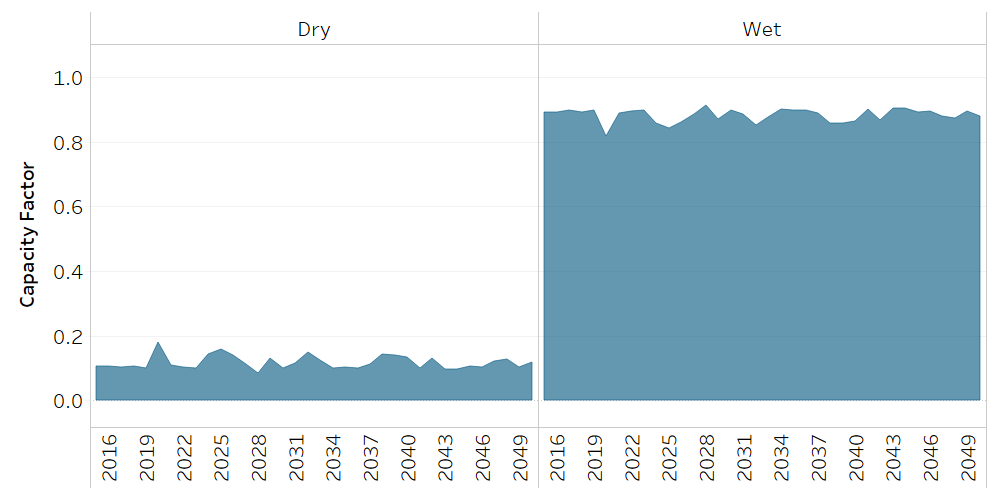

Water: Precipitation
==================================

Precipitation
++++++++++

.. table::
  :align:   center  
  
  +-------------------------------------------------+-------+--------------+--------------+--------------+--------------+
  | .. figure:: img/img_precipitation.png                                                                               |
  |    :align:   center                                                                                                 |
  |    :width:   500 px                                                                                                 |
  +-------------------------------------------------+-------+--------------+--------------+--------------+--------------+
  | Set codification:                                       |CRENPRECIP                                                 |
  +-------------------------------------------------+-------+--------------+--------------+--------------+--------------+
  | Description:                                            |Precipitation                                              |
  +-------------------------------------------------+-------+--------------+--------------+--------------+--------------+
  | Set:                                                    |Technology                                                 |
  +-------------------------------------------------+-------+--------------+--------------+--------------+--------------+
  

CapacityFactor[r,t,y]
---------

   
   *Figure: Precipitation Capacity Factor* :download:`. <csv/Preci_CapacityFactort.csv>`

