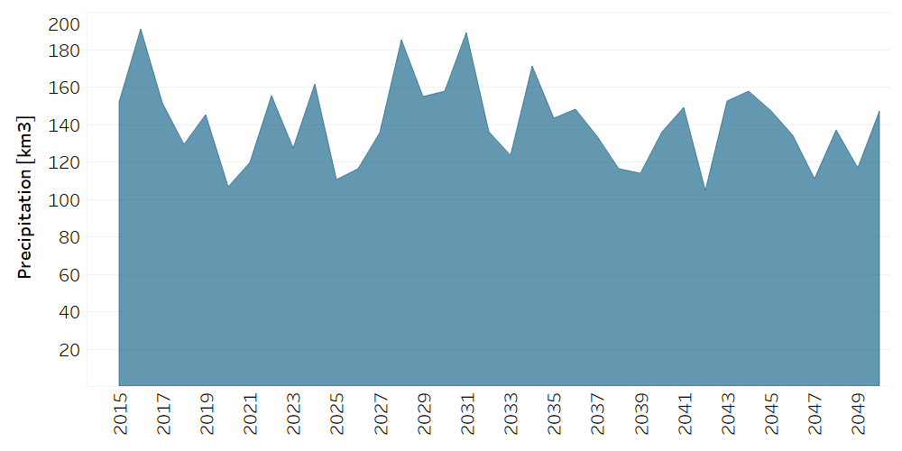

Water: Precipitation
==================================

Precipitation
++++++++++

.. table::
  :align:   center  
  
  +-------------------------------------------------+-------+--------------+--------------+--------------+--------------+
  | .. figure:: img/img_precipitation.png                                                                               |
  |    :align:   center                                                                                                 |
  |    :width:   500 px                                                                                                 |
  +-------------------------------------------------+-------+--------------+--------------+--------------+--------------+
  | Set codification:                                       |CRENPRECIP                                                 |
  +-------------------------------------------------+-------+--------------+--------------+--------------+--------------+
  | Description:                                            |Precipitation                                              |
  +-------------------------------------------------+-------+--------------+--------------+--------------+--------------+
  | Set:                                                    |Technology                                                 |
  +-------------------------------------------------+-------+--------------+--------------+--------------+--------------+
  
TotalTechnologyAnnual Activity[r,t,y]
---------

A homogeneous precipitation is assumed at the spatial level in units of cubic kilometers per megahectare (km3/Mha), de data is based on the Regional Climate Model by the Geophysical Research Center (CIGEFI).

   
   *Figure: Total Technology Annual Activity Capacity Factor* :download:`. <csv/Precipitation_TotalTechnologyAnnualActivity.csv>`

CapacityFactor[r,t,y]
---------

The Capacity Factor is the relationship given between the accumulated precipitation of the season, in this case dry or wet, and the annual amount. This parameter is based on the following equation:

.. math::

   Cf = \frac{Pe}{Pa}

.. figure::  parameters/Preci_CapacityFactor.png
   :align:   center
   :width:   550 px
   
   *Figure: Precipitation Capacity Factor* :download:`. <csv/Preci_CapacityFactor.csv>`

