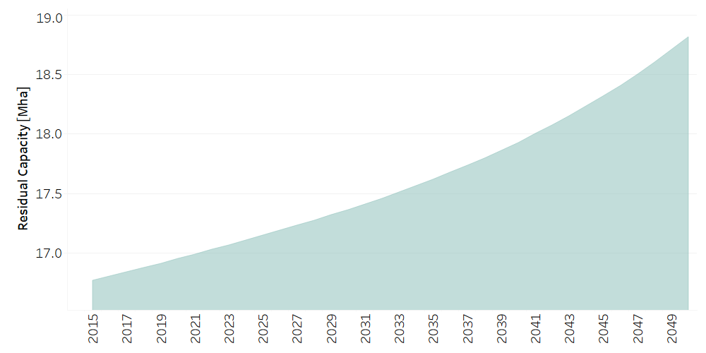
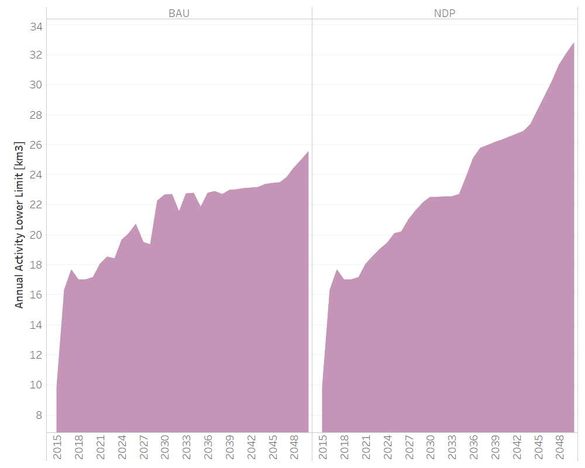
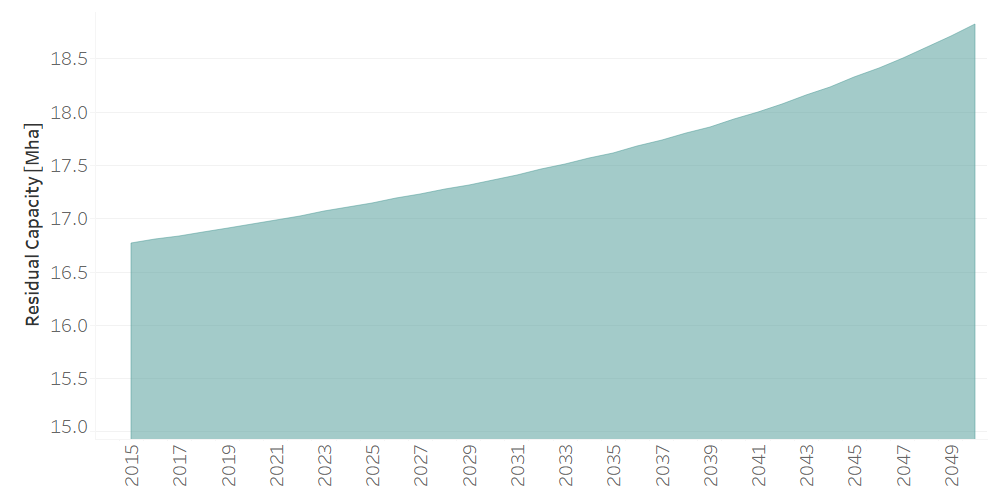

Water: Water Balance
==================================

Water Balance
++++++++++

.. table::
  :align:   center  
  
  +-------------------------------------------------+-------+--------------+--------------+--------------+--------------+
  | .. figure:: img/img_water_balance.png                                                                               |
  |    :align:   center                                                                                                 |
  |    :width:   500 px                                                                                                 |
  +-------------------------------------------------+-------+--------------+--------------+--------------+--------------+
  | Set codification:                                       |CRRETSUP, CRRETSUB                                         |
  +-------------------------------------------------+-------+--------------+--------------+--------------+--------------+
  | Description:                                            |Water Balance                                              |
  +-------------------------------------------------+-------+--------------+--------------+--------------+--------------+
  | Set:                                                    |Technology                                                 |
  +-------------------------------------------------+-------+--------------+--------------+--------------+--------------+

Superficial water return
++++++++++

The general percentage is based on information from the 2015 Water Account of the BCCR.

TotalTechnologyAnnualActivityLo[r,t,y]
---------
.. figure::  parameters/CRRETSUP_Activity_Lo.png
   :align:   center
   :width:   550 px
   
   *Figure: Total Technology Annual Activity for Superficial water return* :download:`. <csv/CRRETSUP_Activity_Lo.csv>`

ResidualCapacity[r,t,y]
---------

   
   *Figure: Residual Capacity of Superficial water return* :download:`. <csv/CRRETSUP_Residual_Capacity.csv>`

Underground water return
++++++++++

TotalTechnologyAnnualActivityLo[r,t,y]
---------

   
   *Figure: Total Technology Annual Activity for Underground water return* :download:`. <csv/CRRETSUB_Activity_Lo.csv>`

ResidualCapacity[r,t,y]
---------

   
   *Figure: Residual Capacity for Underground water return* :download:`. <csv/CRRETSUB_Residual_Capacity.csv>`

EVAPOTRANSPIRATION
++++++++++

The general percentage is based on onformation from the 2015 Water Account of the BCCR. The specific percentage by type of coverage is adjusted to match the percentage of environmental accounts. 
