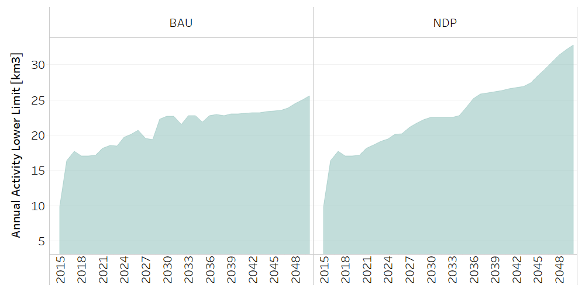
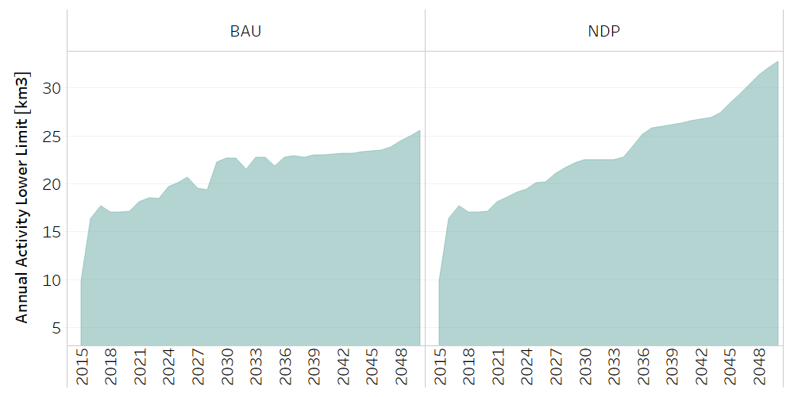
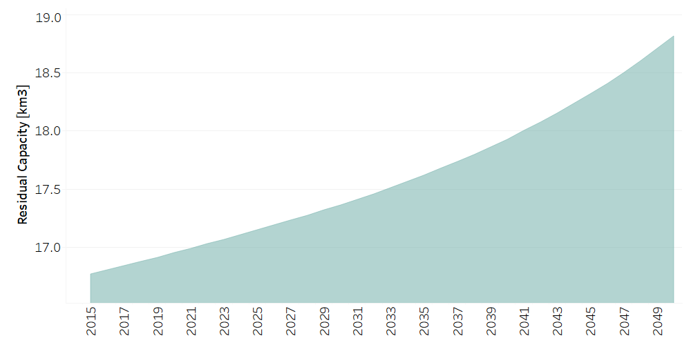

Water: Water Balance
==================================

Water Balance
++++++++++

.. table::
  :align:   center  
  
  +-------------------------------------------------+-------+--------------+--------------+--------------+--------------+
  | .. figure:: img/img_water_balance.png                                                                               |
  |    :align:   center                                                                                                 |
  |    :width:   500 px                                                                                                 |
  +-------------------------------------------------+-------+--------------+--------------+--------------+--------------+
  | Set codification:                                       |CRRETSUP, CRRETSUB                                         |
  +-------------------------------------------------+-------+--------------+--------------+--------------+--------------+
  | Description:                                            |Water Balance                                              |
  +-------------------------------------------------+-------+--------------+--------------+--------------+--------------+
  | Set:                                                    |Technology                                                 |
  +-------------------------------------------------+-------+--------------+--------------+--------------+--------------+

Superficial water return
++++++++++

The general percentage of water supply by superficial water return is based on information from the 2015 Central Bank of Costa Rica Water Account. The specific percentage by type of coverage is adjusted to match the percentage of environmental accounts.

TotalTechnologyAnnualActivityLo[r,t,y]
---------

   
   *Figure: Total Technology Annual Activity for Superficial water return* :download:`. <csv/CRRETSUP_Activity_Lo.csv>`

ResidualCapacity[r,t,y]
---------

It is assumed that the residual capacity is equal to the activity of each technology.

   
   *Figure: Residual Capacity of Superficial water return* :download:`. <csv/CRRETSUP_Residual_Capacity.csv>`

Underground water return
++++++++++

The general percentage of water supply by Underground water return is based on information from the 2015 Central Bank of Costa Rica Water Account. The specific percentage by type of coverage is adjusted to match the percentage of environmental accounts. 

TotalTechnologyAnnualActivityLo[r,t,y]
---------

   
   *Figure: Total Technology Annual Activity for Underground water return* :download:`. <csv/CRRETSUB_Activity_Lo.csv>`

ResidualCapacity[r,t,y]
---------

It is assumed that the residual capacity is equal to the activity of each technology.

   
   *Figure: Residual Capacity for Underground water return* :download:`. <csv/CRRETSUB_Residual_Capacity.csv>`

Evapotranspiration
++++++++++

The general percentage of water supply by evapotranspiration is based on information from the 2015 Central Bank of Costa Rica Water Account. The specific percentage by type of coverage is adjusted to match the percentage of environmental accounts. 
