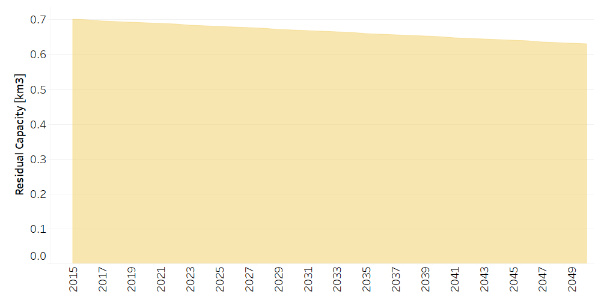

Water: Water Distribution
==================================

Water Distribution
++++++++++

.. table::
   :align:   center  

   +-------------------------------------------------+-------+--------------+--------------+--------------+--------------+
   | .. figure:: img/img_distribution.png                                                                                |
   |    :align:   center                                                                                                 |
   |    :width:   500 px                                                                                                 |
   +-------------------------------------------------+-------+--------------+--------------+--------------+--------------+
   | Set codification:                                       |CRREDACUED                                                 |
   +-------------------------------------------------+-------+--------------+--------------+--------------+--------------+
   | Description:                                            |Water Distribution                                         |
   +-------------------------------------------------+-------+--------------+--------------+--------------+--------------+
   | Set:                                                    |Technology                                                 |
   +-------------------------------------------------+-------+--------------+--------------+--------------+--------------+

ResidualCapacity[r,t,y]
---------
It is assumed that the capacity is equal to the activity of the technologies. 

   
   *Figure: Residual Capacity of Water Distribution* :download:`. <csv/CRREDACUED_Residual_Capacity.csv>`

CapitalCost[r,t,y]
---------

The capital cost is given in MUS$ per km3. This information is based on the National Sanitation Investment Plan, on international sources and on projects of the Institute of Aqueducts and Sewers (AYA).

.. table::
   :align:   center  

   +-------------------------------------------------+-------+--------------+--------------+--------------+--------------+
   | Constant Value                                          |198.5 MUS$/km3                                             |
   +-------------------------------------------------+-------+--------------+--------------+--------------+--------------+

FixedCost[r,t,y]
---------

The fix cost is given in MUS$ per km3. This information is based on projects of the Costa Rican Institute of Aqueducts and Sewers (AYA), for current and future technologies.

.. table::
   :align:   center  

   +-------------------------------------------------+-------+--------------+--------------+--------------+--------------+
   | Constant Value                                          |752.7 MUS$/km3                                             |
   +-------------------------------------------------+-------+--------------+--------------+--------------+--------------+
   
EmissionActivityRatio[r,t,e,m,y]
---------

The data of emissions is based on the National Inventory of Greenhouse Gases and Carbon Absorption from the National Meteorological Institute (IMN). 

.. table::
   :align:   center  

   +-------------------------------------------------+-------+--------------+--------------+--------------+--------------+
   | Constant Value                                          | 1 [MtonCO2eq/km3]                                         |
   +-------------------------------------------------+-------+--------------+--------------+--------------+--------------+

OutputActivityRatiot[r,t,y]
---------

The aqueduct network also includes losses due to leaks and illegal intakes, which correspond to 50%, so the output of this technology is 0.5, for current and future technologies. 

.. table::
   :align:   center  

   +-------------------------------------------------+-------+--------------+--------------+--------------+--------------+
   | Constant Value                                          | 40%                                                       |
   +-------------------------------------------------+-------+--------------+--------------+--------------+--------------+
