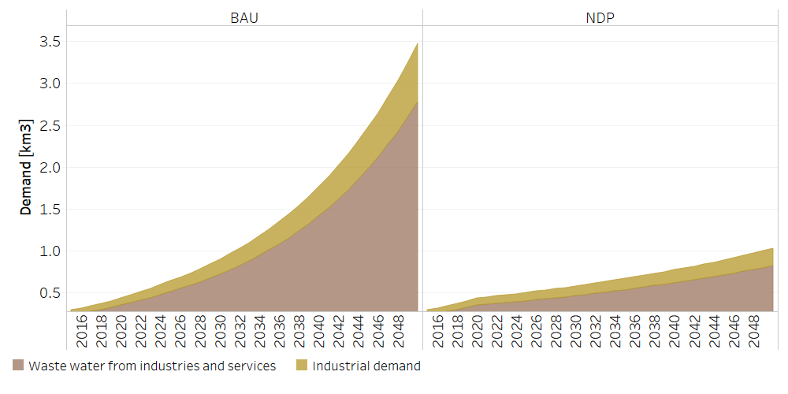

Water: Demands
==================================

Water Demands
++++++++++

The Water Demand corresponds to the current and future demand of water resources for each user sector and it is given in cubic kilometers [km3]. In the total demand of water resources, one part is effectively consumed and the other becomes wastewater. To establish this distribution, the percentages of actual consumption assumed in the Central Bank of Costa Rica's water account were used. The projections were made based on data from the National Plan for Integrated Water Resources Management and from the model projections of Land Use and Energy Sectors, corresponding to the extension of crops and the growth of hydroelectric generation plants, specifically.

.. table::
   :align:   center  

   +-------------------------------------------------+-------+--------------+--------------+--------------+--------------+
   | .. figure:: img/img_water_demands.png                                                                               |
   |    :align:   center                                                                                                 |
   |    :width:   500 px                                                                                                 |
   +-------------------------------------------------+-------+--------------+--------------+--------------+--------------+
   | Set codification:                                       |CR05DEMAGROP, CR05DEMINDYSERV,                             |
   |                                                         |CR05DEMHIDROELECTRICIDAD, CR05DEMCOHUMANO                  |   
   |                                                         |CR06VERTCOHUMANO, CR06VERTINDYSERV                         |
   +-------------------------------------------------+-------+--------------+--------------+--------------+--------------+
   | Description:                                            |Water Demands                                              |
   +-------------------------------------------------+-------+--------------+--------------+--------------+--------------+
   | Set:                                                    |Technology                                                 |
   +-------------------------------------------------+-------+--------------+--------------+--------------+--------------+

SpecifiedAnnualDemand[r,t,y]
---------

For residential, commercial and turism Water Specified Annual Demand, an average per capita consumption was established from the Central Bank of Costa Rica's water account data between 2012-2015 and multiplied by the population projections of the National Institute of Statistics and Censuses of Costa Rica, as shown in the following equation:

.. math::

   Human consumption demand =  Consumption per capita * population
   
   
.. figure::  parameters/Human_Consumtion_Specified_Annual_Demand.png
   :align:   center
   :width:   550 px
   
   *Figure: Human Consumtion Specified Annual Demand* :download:`. <csv/Human_Consumtion_Specified_Annual_Demand.csv>`
   
The projections of the Industrial Water Specified Annual Demand is estimated from the annual growth established by the National Plan for Integrated Water Resources Management.
   
   

   
   *Figure: Industrial Water Specified Annual Demand* :download:`. <csv/Industrial_Specified_Annual_Demand.csv>`
   
The Water Specified Annual Demand for hydroelectricity is Based on the National Energy Control Center (CENCE) reports and energy model projections. 

.. math::

   Hydroelectric generation demand = Water Req * kWh

.. figure::  parameters/Hidro_Consumtion_Specified_Annual_Demand.png
   :align:   center
   :width:   550 px
    
   *Figure: Water Specified Annual Demand for hydroelectricity* :download:`. <csv/Hidro_Consumtion_Specified_Annual_Demand.csv>`  
   
The calculation of the water demand for the agricultural sector is based on the water footprint of crops, the data is obtenied from the National University and from internation reports. The coverage projections of the land use model are calculated as shown below:

.. math::

   Agricultural Demand =  ReqAgua \frac{km2}{Mha} Activity coverage
   
   
.. figure::  parameters/Agriculture_Consumtion_Specified_Annual_Demand.png
   :align:   center
   :width:   550 px
    
   *Figure: Water Specified Annual Demand for Agriculture* :download:`. <csv/Agriculture_Consumtion_Specified_Annual_Demand.csv>`  
   

   
