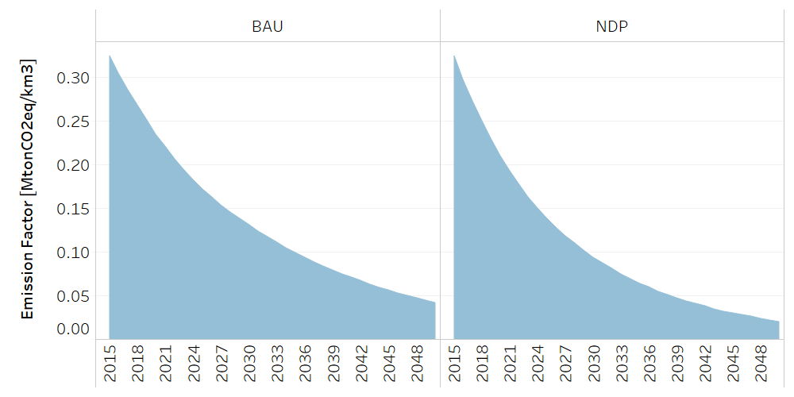

Water: Wastewater disposal
==================================

Wastewater disposal
++++++++++

The structure of Discharges and wastewater treatment is based on the National Policy on Wastewater Sanitation Sewage. 

.. table::
   :align:   center  

   +-------------------------------------------------+-------+--------------+--------------+--------------+--------------+
   | .. figure:: img/img_wastewater_sewage.png                                                                           |
   |    :align:   center                                                                                                 |
   |    :width:   500 px                                                                                                 |
   +-------------------------------------------------+-------+--------------+--------------+--------------+--------------+
   | Set codification:                                       |CRALCURB                                                   |
   +-------------------------------------------------+-------+--------------+--------------+--------------+--------------+
   | Description:                                            |Sewage                                                     |
   +-------------------------------------------------+-------+--------------+--------------+--------------+--------------+
   | Set:                                                    |Technology                                                 |
   +-------------------------------------------------+-------+--------------+--------------+--------------+--------------+

CapitalCost[r,t,y]
---------

The capital cost is given in MUS$ per km3. This information is based on the National Sanitation Investment Plan. 

.. table::
   :align:   center  

   +-------------------------------------------------+-------+--------------+--------------+--------------+--------------+
   | Constant Value                                          | 723.9 MUS$/km3                                            |
   +-------------------------------------------------+-------+--------------+--------------+--------------+--------------+
   

Water treatment of industrial wastewater
++++++++++

.. table::
   :align:   center  

   +-------------------------------------------------+-------+--------------+--------------+--------------+--------------+
   | .. figure:: img/img_water_treatment_industrial.png                                                                  |
   |    :align:   center                                                                                                 |
   |    :width:   500 px                                                                                                 |
   +-------------------------------------------------+-------+--------------+--------------+--------------+--------------+
   | Set codification:                                       |CRVTRATINDYSERV                                            |
   +-------------------------------------------------+-------+--------------+--------------+--------------+--------------+
   | Description:                                            |Water treatment of industrial wastewater                   |
   +-------------------------------------------------+-------+--------------+--------------+--------------+--------------+
   | Set:                                                    |Technology                                                 |
   +-------------------------------------------------+-------+--------------+--------------+--------------+--------------+

CapitalCost[r,t,y]
---------

The capital cost is given in MUS$ per Mha. This information is based on reports of ################. It includes aspects such as ... In new technologies of Urban Sewerage the capital cost remains the same.

.. table::
   :align:   center  

   +-------------------------------------------------+-------+--------------+--------------+--------------+--------------+
   | Constant Value                                          | 605,2 MUS$/km3                                            |
   +-------------------------------------------------+-------+--------------+--------------+--------------+--------------+
   
   EmissionActivityRatio[r,t,e,m,y]
---------

The data of emissions is based on the National Inventory of Greenhouse Gases and Carbon Absorption from the National Meteorological Institute. 

   
   *Figure: Emission Activity Ratio of Water treatment of industrial wastewater* :download:`. <csv/CRVTRATINDYSERV_Emission_Act_Ratio.csv>`

