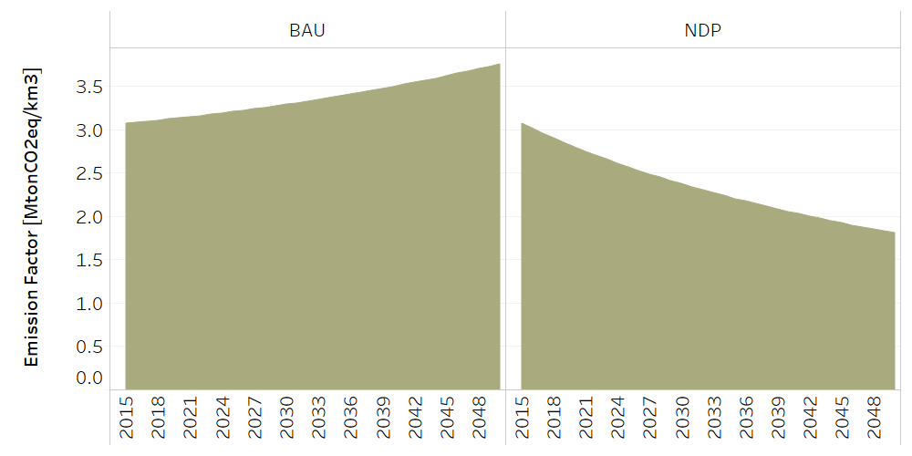
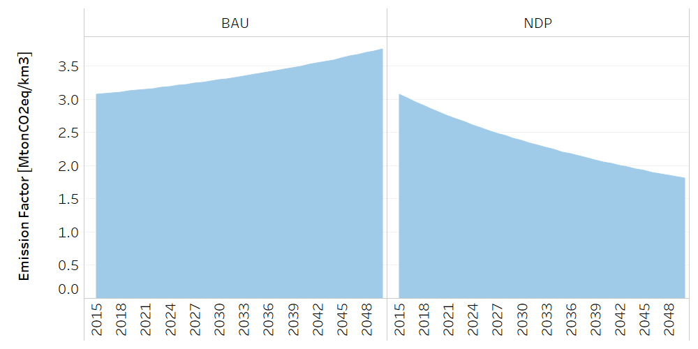
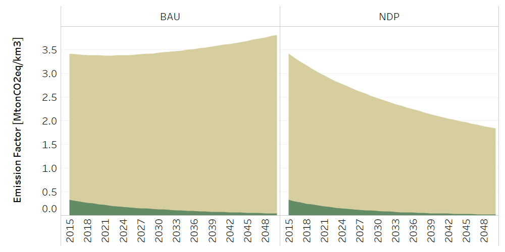

Water: Wastewater disposal
==================================

The structure of Discharges and wastewater treatment is based on the National Policy on Wastewater Sanitation Sewage. 
++++++++++

.. table::
   :align:   center  

   +-------------------------------------------------+-------+--------------+--------------+--------------+--------------+
   | .. figure:: img/img_wastewater_sewage.png                                                                           |
   |    :align:   center                                                                                                 |
   |    :width:   500 px                                                                                                 |
   +-------------------------------------------------+-------+--------------+--------------+--------------+--------------+
   | Set codification:                                       |CRALCURB                                                   |
   +-------------------------------------------------+-------+--------------+--------------+--------------+--------------+
   | Description:                                            |Sewage                                                     |
   +-------------------------------------------------+-------+--------------+--------------+--------------+--------------+
   | Set:                                                    |Technology                                                 |
   +-------------------------------------------------+-------+--------------+--------------+--------------+--------------+

CapitalCost[r,t,y]
---------

The capital cost is given in MUS$ per km3. This information is based on the National Sanitation Investment Plan. 

.. table::
   :align:   center  

   +-------------------------------------------------+-------+--------------+--------------+--------------+--------------+
   | Constant Value                                          | 723.9 MUS$/km3                                            |
   +-------------------------------------------------+-------+--------------+--------------+--------------+--------------+
   

Water treatment of industrial wastewater
++++++++++

.. table::
   :align:   center  

   +-------------------------------------------------+-------+--------------+--------------+--------------+--------------+
   | .. figure:: img/img_water_treatment_industrial.png                                                                  |
   |    :align:   center                                                                                                 |
   |    :width:   500 px                                                                                                 |
   +-------------------------------------------------+-------+--------------+--------------+--------------+--------------+
   | Set codification:                                       |CRVTRATINDYSERV                                            |
   +-------------------------------------------------+-------+--------------+--------------+--------------+--------------+
   | Description:                                            |Water treatment of industrial wastewater                   |
   +-------------------------------------------------+-------+--------------+--------------+--------------+--------------+
   | Set:                                                    |Technology                                                 |
   +-------------------------------------------------+-------+--------------+--------------+--------------+--------------+

CapitalCost[r,t,y]
---------

The capital cost is given in MUS$ per Mha. This information is based on reports of ################. It includes aspects such as ... In new technologies of Urban Sewerage the capital cost remains the same.

.. table::
   :align:   center  

   +-------------------------------------------------+-------+--------------+--------------+--------------+--------------+
   | Constant Value                                          | 605,2 MUS$/km3                                            |
   +-------------------------------------------------+-------+--------------+--------------+--------------+--------------+
   

EmissionActivityRatio[r,t,e,m,y]
---------

The data on emissions is based on #####

.. figure::  parameters/CRVTRATINDYSERV_Emission_Act_Ratio.png
   :align:   center
   :width:   550 px
   
   *Figure: Emission Activity Ratio of Water treatment of industrial wastewater* :download:`. <csv/CRVTRATINDYSERV_Emission_Act_Ratio.csv>`

Septic tank
++++++++++

.. table::
   :align:   center  

   +-------------------------------------------------+-------+--------------+--------------+--------------+--------------+
   | .. figure:: img/img_water_septic_tank.png                                                                           |
   |    :align:   center                                                                                                 |
   |    :width:   500 px                                                                                                 |
   +-------------------------------------------------+-------+--------------+--------------+--------------+--------------+
   | Set codification:                                       |CRPOZOSRUR                                                 |
   +-------------------------------------------------+-------+--------------+--------------+--------------+--------------+
   | Description:                                            |Septic Tank                                                |
   +-------------------------------------------------+-------+--------------+--------------+--------------+--------------+
   | Set:                                                    |Technology                                                 |
   +-------------------------------------------------+-------+--------------+--------------+--------------+--------------+

CapitalCost[r,t,y]
---------

The capital cost is given in MUS$ per Mha. This information is based on reports of ################. It includes aspects such as ... In new technologies of Urban Sewerage the capital cost remains the same.

.. table::
   :align:   center  

   +-------------------------------------------------+-------+--------------+--------------+--------------+--------------+
   | Constant Value                                          | 49,78  MUS$/km3                                           |
   +-------------------------------------------------+-------+--------------+--------------+--------------+--------------+
   

EmissionActivityRatio[r,t,e,m,y]
---------

The data on emissions is based on #####

   
   *Figure: Emission Activity Ratio of Septic tanks* :download:`. <csv/CRPOZOSRUR_Emission_Act_Ratio.csv>`

AnnualActivityLowerLimit[r,t,e,m,y]
---------

 #####

   
   *Figure: Annual Activity Lower Limit of Septic tanks* :download:`. <csv/CRPOZOSRURFUT_Activity_Lo.csv>`

Water treatment of wastewater from human consumption
++++++++++

.. table::
   :align:   center  

   +-------------------------------------------------+-------+--------------+--------------+--------------+--------------+
   | .. figure:: img/img_water_treatment_residential.png                                                                 |
   |    :align:   center                                                                                                 |
   |    :width:   500 px                                                                                                 |
   +-------------------------------------------------+-------+--------------+--------------+--------------+--------------+
   | Set codification:                                       |CRVTRATCOHUMANO                                            |
   +-------------------------------------------------+-------+--------------+--------------+--------------+--------------+
   | Description:                                            |Water treatment of wastewater from human consumption       |
   +-------------------------------------------------+-------+--------------+--------------+--------------+--------------+
   | Set:                                                    |Technology                                                 |
   +-------------------------------------------------+-------+--------------+--------------+--------------+--------------+

CapitalCost[r,t,y]
---------

The capital cost is given in MUS$ per Mha. This information is based on reports of ################. It includes aspects such as ... In new technologies of Urban Sewerage the capital cost remains the same.

.. table::
   :align:   center  

   +-------------------------------------------------+-------+--------------+--------------+--------------+--------------+
   | Constant Value                                          | 605,2 MUS$/km3                                            |
   +-------------------------------------------------+-------+--------------+--------------+--------------+--------------+

EmissionActivityRatio[r,t,e,m,y]
---------

The data on emissions is based on #####

   
   *Figure: Emission Activity Ratio of Water treatment of wastewater from human consumption* :download:`. <csv/CRVTRATCOHUMANO_Emission_Act_Ratio.csv>`

AnnualActivityLowerLimit[r,t,e,m,y]
---------

 #####

   
   *Figure: Annual Activity Lower Limit of Water treatment of wastewater from human consumption* :download:`. <csv/CRVTRATFUTCOHUMANOActivity_Lo.csv>`

Water without treatment
++++++++++

.. table::
   :align:   center  

   +-------------------------------------------------+-------+--------------+--------------+--------------+--------------+
   | .. figure:: img/img_disposal_no_treatment.png                                                                       |
   |    :align:   center                                                                                                 |
   |    :width:   500 px                                                                                                 |
   +-------------------------------------------------+-------+--------------+--------------+--------------+--------------+
   | Set codification:                                       |CRVSINTRATCOHUMANO, CRVSINTRATINDYSERV                     |
   +-------------------------------------------------+-------+--------------+--------------+--------------+--------------+
   | Description:                                            |Water without treatment                                    |
   +-------------------------------------------------+-------+--------------+--------------+--------------+--------------+
   | Set:                                                    |Technology                                                 |
   +-------------------------------------------------+-------+--------------+--------------+--------------+--------------+

EmissionActivityRatio[r,t,e,m,y]
---------

The data on emissions is based on #####

   
   *Figure: Emission Activity Ratio of Water without treatment* :download:`. <csv/CRVSINTRAT_Emission_Act_Ratio.csv>`

